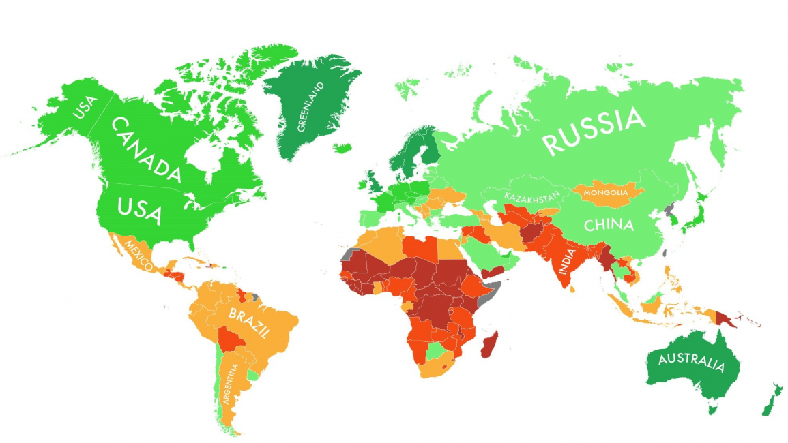

WeatherPy



Table of contents
1. Introduction
2. Generate random list for latitudes and longitudes
3. Locate Nearest City
4. Generate Dataframe for all latitudes and longitudes
6. Use Openweathermap API
7. Scatter Plots and Tables
9. Conclusion

Instructions


In this example, you'll be creating a Python script to visualize the weather of 500+ cities across the world of varying distance from the equator. To accomplish this, you'll be utilizing a [simple Python library](https://pypi.python.org/pypi/citipy), the [OpenWeatherMap API](https://openweathermap.org/api), and a little common sense to create a representative model of weather across world cities.

Your objective is to build a series of scatter plots to showcase the following relationships:

* Temperature (F) vs. Latitude
* Humidity (%) vs. Latitude
* Cloudiness (%) vs. Latitude
* Wind Speed (mph) vs. Latitude

Your final notebook must:

* Randomly select **at least** 500 unique (non-repeat) cities based on latitude and longitude.
* Perform a weather check on each of the cities using a series of successive API calls.
* Include a print log of each city as it's being processed with the city number and city name.
* Save both a CSV of all data retrieved and png images for each scatter plot.

As final considerations:

* You must use Matplotlib to create your plots.
* You must include a written description of three observable trends based on the data.
* You must use proper labeling of your plots, including aspects like: Plot Titles (with date of analysis) and Axes Labels.

<h3><u>Import libraries</u></h3>


```python
import pandas as pd
from citipy import citipy
import numpy as np
import pandas as pd
import requests
import json
import seaborn as sns
import matplotlib.pyplot as plt
%matplotlib inline
```

<h3><u>Generate random list for latitudes and longitudes</u></h3>


```python
#generate random list for latitudes and longitudes 

latitude = []
longitude = []

for each_lat in np.random.randint(-90,90,2000):
    latitude.append(each_lat)

for each_lon in np.random.randint(-180,180,2000):
    longitude.append(each_lon)
    
```


```python
#Create and variable called latitude_and_Longitude and store all random latitudes and longitudes generated

latitude_and_Longitude = tuple(zip(latitude,longitude))
```

<h3><u>Locate Nearest City</u></h3>


```python
#use citipy library to find the nearest city for all latitudes and longitudes

cities = []
country = []

for lat,lon in latitude_and_Longitude:
    city = citipy.nearest_city(lat,lon)
    
    cityName = city.city_name
    
    cities.append(cityName)
    
    country.append(city.country_code)
    
    
```


```python
#Print out how many the different cities were generated

print('The above script has generated {} different cities using random numbers.'.format(len(set(cities))))
```

    The above script has generated 747 different cities using random numbers.


<h3><u>Generate Dataframe for all latitudes and longitudes</u></h3>


```python
#create a dataframe to store all the cities and countries generated with citipy

df_countries = pd.DataFrame({'Cities': cities,
              'Country': country})

#add additional blank columns to store information from openweathermap api

df_countries['Latitude'] = ''
df_countries['Longitude'] = ''
df_countries['Temperature (F)'] = ''
df_countries['Humidity (%)'] = ''
df_countries['Cloudiness (%)'] = ''
df_countries['Wind Speed (mph)'] = ''
```


```python
#drop all duplicates in column Cities.

df_countries = df_countries.drop_duplicates(subset=['Cities'],keep='first')
```


```python
#api key used with openweathermap api

api_key = "5be78fade1727ace968b5ab363d997bd"
```

<h3><u>Use Openweathermap API</u></h3>


```python
#loop through all rows and fill in values for blank columns in dataframe

for index,row in df_countries.iterrows():
    city_name = row['Cities']
    Country_id = row['Country']
    
    
    #api call for all Cities 
    api_url = "http://api.openweathermap.org/data/2.5/forecast" \
    "?q={},{}&units=IMPERIAL&mode=json&APPID={}".format(city_name,Country_id,api_key)
    
    
    country_info = requests.get(api_url).json()
    
    #print all api url's for each city
    print(api_url)
    
    
    try:
        df_countries.set_value(index,'Latitude',country_info['city']['coord']['lat'])
        df_countries.set_value(index,'Longitude',country_info['city']['coord']['lon'])
        df_countries.set_value(index,'Temperature (F)',country_info['list'][0]['main']['temp'])
        df_countries.set_value(index,'Humidity (%)',country_info['list'][0]['main']['humidity'])
        df_countries.set_value(index,'Cloudiness (%)',country_info['list'][0]['clouds']['all'])
        df_countries.set_value(index,'Wind Speed (mph)',country_info['list'][0]['wind']['speed'])
        
    except KeyError:
        df_countries.set_value(index,'Latitude',np.nan)
        df_countries.set_value(index,'Longitude',np.nan)
        df_countries.set_value(index,'Temperature (F)',np.nan)
        df_countries.set_value(index,'Humidity (%)',np.nan)
        df_countries.set_value(index,'Cloudiness (%)',np.nan)
        df_countries.set_value(index,'Wind Speed (mph)',np.nan)
        
        print('Missing weather information...skip')


    
```

    http://api.openweathermap.org/data/2.5/forecast?q=mahebourg,mu&units=IMPERIAL&mode=json&APPID=5be78fade1727ace968b5ab363d997bd
    http://api.openweathermap.org/data/2.5/forecast?q=klaksvik,fo&units=IMPERIAL&mode=json&APPID=5be78fade1727ace968b5ab363d997bd
    http://api.openweathermap.org/data/2.5/forecast?q=tiarei,pf&units=IMPERIAL&mode=json&APPID=5be78fade1727ace968b5ab363d997bd
    http://api.openweathermap.org/data/2.5/forecast?q=east london,za&units=IMPERIAL&mode=json&APPID=5be78fade1727ace968b5ab363d997bd
    http://api.openweathermap.org/data/2.5/forecast?q=saskylakh,ru&units=IMPERIAL&mode=json&APPID=5be78fade1727ace968b5ab363d997bd
    http://api.openweathermap.org/data/2.5/forecast?q=tarakan,id&units=IMPERIAL&mode=json&APPID=5be78fade1727ace968b5ab363d997bd
    http://api.openweathermap.org/data/2.5/forecast?q=nome,us&units=IMPERIAL&mode=json&APPID=5be78fade1727ace968b5ab363d997bd
    http://api.openweathermap.org/data/2.5/forecast?q=constitucion,mx&units=IMPERIAL&mode=json&APPID=5be78fade1727ace968b5ab363d997bd
    Missing weather information...skip
    http://api.openweathermap.org/data/2.5/forecast?q=ushuaia,ar&units=IMPERIAL&mode=json&APPID=5be78fade1727ace968b5ab363d997bd
    http://api.openweathermap.org/data/2.5/forecast?q=taolanaro,mg&units=IMPERIAL&mode=json&APPID=5be78fade1727ace968b5ab363d997bd
    Missing weather information...skip
    http://api.openweathermap.org/data/2.5/forecast?q=kapaa,us&units=IMPERIAL&mode=json&APPID=5be78fade1727ace968b5ab363d997bd
    http://api.openweathermap.org/data/2.5/forecast?q=maningrida,au&units=IMPERIAL&mode=json&APPID=5be78fade1727ace968b5ab363d997bd
    http://api.openweathermap.org/data/2.5/forecast?q=bluff,nz&units=IMPERIAL&mode=json&APPID=5be78fade1727ace968b5ab363d997bd
    http://api.openweathermap.org/data/2.5/forecast?q=rikitea,pf&units=IMPERIAL&mode=json&APPID=5be78fade1727ace968b5ab363d997bd
    http://api.openweathermap.org/data/2.5/forecast?q=cape town,za&units=IMPERIAL&mode=json&APPID=5be78fade1727ace968b5ab363d997bd
    http://api.openweathermap.org/data/2.5/forecast?q=anito,ph&units=IMPERIAL&mode=json&APPID=5be78fade1727ace968b5ab363d997bd
    http://api.openweathermap.org/data/2.5/forecast?q=busselton,au&units=IMPERIAL&mode=json&APPID=5be78fade1727ace968b5ab363d997bd
    http://api.openweathermap.org/data/2.5/forecast?q=georgetown,sh&units=IMPERIAL&mode=json&APPID=5be78fade1727ace968b5ab363d997bd
    http://api.openweathermap.org/data/2.5/forecast?q=punta arenas,cl&units=IMPERIAL&mode=json&APPID=5be78fade1727ace968b5ab363d997bd
    http://api.openweathermap.org/data/2.5/forecast?q=skelleftea,se&units=IMPERIAL&mode=json&APPID=5be78fade1727ace968b5ab363d997bd
    http://api.openweathermap.org/data/2.5/forecast?q=togur,ru&units=IMPERIAL&mode=json&APPID=5be78fade1727ace968b5ab363d997bd
    http://api.openweathermap.org/data/2.5/forecast?q=louisbourg,ca&units=IMPERIAL&mode=json&APPID=5be78fade1727ace968b5ab363d997bd
    Missing weather information...skip
    http://api.openweathermap.org/data/2.5/forecast?q=hilo,us&units=IMPERIAL&mode=json&APPID=5be78fade1727ace968b5ab363d997bd
    http://api.openweathermap.org/data/2.5/forecast?q=san cristobal,ec&units=IMPERIAL&mode=json&APPID=5be78fade1727ace968b5ab363d997bd
    http://api.openweathermap.org/data/2.5/forecast?q=port alfred,za&units=IMPERIAL&mode=json&APPID=5be78fade1727ace968b5ab363d997bd
    http://api.openweathermap.org/data/2.5/forecast?q=mehamn,no&units=IMPERIAL&mode=json&APPID=5be78fade1727ace968b5ab363d997bd
    http://api.openweathermap.org/data/2.5/forecast?q=tecoanapa,mx&units=IMPERIAL&mode=json&APPID=5be78fade1727ace968b5ab363d997bd
    http://api.openweathermap.org/data/2.5/forecast?q=luderitz,na&units=IMPERIAL&mode=json&APPID=5be78fade1727ace968b5ab363d997bd
    http://api.openweathermap.org/data/2.5/forecast?q=kamenskoye,ru&units=IMPERIAL&mode=json&APPID=5be78fade1727ace968b5ab363d997bd
    Missing weather information...skip
    http://api.openweathermap.org/data/2.5/forecast?q=pacific grove,us&units=IMPERIAL&mode=json&APPID=5be78fade1727ace968b5ab363d997bd
    http://api.openweathermap.org/data/2.5/forecast?q=belushya guba,ru&units=IMPERIAL&mode=json&APPID=5be78fade1727ace968b5ab363d997bd
    Missing weather information...skip
    http://api.openweathermap.org/data/2.5/forecast?q=castro,cl&units=IMPERIAL&mode=json&APPID=5be78fade1727ace968b5ab363d997bd
    http://api.openweathermap.org/data/2.5/forecast?q=nouadhibou,mr&units=IMPERIAL&mode=json&APPID=5be78fade1727ace968b5ab363d997bd
    http://api.openweathermap.org/data/2.5/forecast?q=lebu,cl&units=IMPERIAL&mode=json&APPID=5be78fade1727ace968b5ab363d997bd
    http://api.openweathermap.org/data/2.5/forecast?q=cockburn town,tc&units=IMPERIAL&mode=json&APPID=5be78fade1727ace968b5ab363d997bd
    http://api.openweathermap.org/data/2.5/forecast?q=dikson,ru&units=IMPERIAL&mode=json&APPID=5be78fade1727ace968b5ab363d997bd
    http://api.openweathermap.org/data/2.5/forecast?q=hovd,mn&units=IMPERIAL&mode=json&APPID=5be78fade1727ace968b5ab363d997bd
    http://api.openweathermap.org/data/2.5/forecast?q=mar del plata,ar&units=IMPERIAL&mode=json&APPID=5be78fade1727ace968b5ab363d997bd
    http://api.openweathermap.org/data/2.5/forecast?q=verkh-usugli,ru&units=IMPERIAL&mode=json&APPID=5be78fade1727ace968b5ab363d997bd
    http://api.openweathermap.org/data/2.5/forecast?q=tiksi,ru&units=IMPERIAL&mode=json&APPID=5be78fade1727ace968b5ab363d997bd
    http://api.openweathermap.org/data/2.5/forecast?q=caluquembe,ao&units=IMPERIAL&mode=json&APPID=5be78fade1727ace968b5ab363d997bd
    http://api.openweathermap.org/data/2.5/forecast?q=fort saint james,ca&units=IMPERIAL&mode=json&APPID=5be78fade1727ace968b5ab363d997bd
    Missing weather information...skip
    http://api.openweathermap.org/data/2.5/forecast?q=pimenta bueno,br&units=IMPERIAL&mode=json&APPID=5be78fade1727ace968b5ab363d997bd
    http://api.openweathermap.org/data/2.5/forecast?q=pingliang,cn&units=IMPERIAL&mode=json&APPID=5be78fade1727ace968b5ab363d997bd
    http://api.openweathermap.org/data/2.5/forecast?q=simao,cn&units=IMPERIAL&mode=json&APPID=5be78fade1727ace968b5ab363d997bd
    http://api.openweathermap.org/data/2.5/forecast?q=sumbawa,id&units=IMPERIAL&mode=json&APPID=5be78fade1727ace968b5ab363d997bd
    Missing weather information...skip
    http://api.openweathermap.org/data/2.5/forecast?q=roebourne,au&units=IMPERIAL&mode=json&APPID=5be78fade1727ace968b5ab363d997bd
    http://api.openweathermap.org/data/2.5/forecast?q=longyearbyen,sj&units=IMPERIAL&mode=json&APPID=5be78fade1727ace968b5ab363d997bd
    http://api.openweathermap.org/data/2.5/forecast?q=talnakh,ru&units=IMPERIAL&mode=json&APPID=5be78fade1727ace968b5ab363d997bd
    http://api.openweathermap.org/data/2.5/forecast?q=bukachacha,ru&units=IMPERIAL&mode=json&APPID=5be78fade1727ace968b5ab363d997bd
    http://api.openweathermap.org/data/2.5/forecast?q=wexford,ie&units=IMPERIAL&mode=json&APPID=5be78fade1727ace968b5ab363d997bd
    Missing weather information...skip
    http://api.openweathermap.org/data/2.5/forecast?q=saint-philippe,re&units=IMPERIAL&mode=json&APPID=5be78fade1727ace968b5ab363d997bd
    http://api.openweathermap.org/data/2.5/forecast?q=iraray,ph&units=IMPERIAL&mode=json&APPID=5be78fade1727ace968b5ab363d997bd
    http://api.openweathermap.org/data/2.5/forecast?q=cinnaminson,us&units=IMPERIAL&mode=json&APPID=5be78fade1727ace968b5ab363d997bd
    http://api.openweathermap.org/data/2.5/forecast?q=atuona,pf&units=IMPERIAL&mode=json&APPID=5be78fade1727ace968b5ab363d997bd
    http://api.openweathermap.org/data/2.5/forecast?q=kavieng,pg&units=IMPERIAL&mode=json&APPID=5be78fade1727ace968b5ab363d997bd
    http://api.openweathermap.org/data/2.5/forecast?q=shar,kz&units=IMPERIAL&mode=json&APPID=5be78fade1727ace968b5ab363d997bd
    http://api.openweathermap.org/data/2.5/forecast?q=kwinana,au&units=IMPERIAL&mode=json&APPID=5be78fade1727ace968b5ab363d997bd
    http://api.openweathermap.org/data/2.5/forecast?q=vaitupu,wf&units=IMPERIAL&mode=json&APPID=5be78fade1727ace968b5ab363d997bd
    Missing weather information...skip
    http://api.openweathermap.org/data/2.5/forecast?q=edd,er&units=IMPERIAL&mode=json&APPID=5be78fade1727ace968b5ab363d997bd
    http://api.openweathermap.org/data/2.5/forecast?q=saint george,bm&units=IMPERIAL&mode=json&APPID=5be78fade1727ace968b5ab363d997bd
    http://api.openweathermap.org/data/2.5/forecast?q=xiongzhou,cn&units=IMPERIAL&mode=json&APPID=5be78fade1727ace968b5ab363d997bd
    http://api.openweathermap.org/data/2.5/forecast?q=jamestown,sh&units=IMPERIAL&mode=json&APPID=5be78fade1727ace968b5ab363d997bd
    http://api.openweathermap.org/data/2.5/forecast?q=hammerfest,no&units=IMPERIAL&mode=json&APPID=5be78fade1727ace968b5ab363d997bd
    http://api.openweathermap.org/data/2.5/forecast?q=puerto ayora,ec&units=IMPERIAL&mode=json&APPID=5be78fade1727ace968b5ab363d997bd
    http://api.openweathermap.org/data/2.5/forecast?q=nador,ma&units=IMPERIAL&mode=json&APPID=5be78fade1727ace968b5ab363d997bd
    http://api.openweathermap.org/data/2.5/forecast?q=torbay,ca&units=IMPERIAL&mode=json&APPID=5be78fade1727ace968b5ab363d997bd
    http://api.openweathermap.org/data/2.5/forecast?q=urumqi,cn&units=IMPERIAL&mode=json&APPID=5be78fade1727ace968b5ab363d997bd
    Missing weather information...skip
    http://api.openweathermap.org/data/2.5/forecast?q=haines junction,ca&units=IMPERIAL&mode=json&APPID=5be78fade1727ace968b5ab363d997bd
    http://api.openweathermap.org/data/2.5/forecast?q=mount gambier,au&units=IMPERIAL&mode=json&APPID=5be78fade1727ace968b5ab363d997bd
    http://api.openweathermap.org/data/2.5/forecast?q=gobabis,na&units=IMPERIAL&mode=json&APPID=5be78fade1727ace968b5ab363d997bd
    http://api.openweathermap.org/data/2.5/forecast?q=achisay,kz&units=IMPERIAL&mode=json&APPID=5be78fade1727ace968b5ab363d997bd
    Missing weather information...skip
    http://api.openweathermap.org/data/2.5/forecast?q=iqaluit,ca&units=IMPERIAL&mode=json&APPID=5be78fade1727ace968b5ab363d997bd
    http://api.openweathermap.org/data/2.5/forecast?q=ponta do sol,cv&units=IMPERIAL&mode=json&APPID=5be78fade1727ace968b5ab363d997bd
    http://api.openweathermap.org/data/2.5/forecast?q=krasnodar,ru&units=IMPERIAL&mode=json&APPID=5be78fade1727ace968b5ab363d997bd
    http://api.openweathermap.org/data/2.5/forecast?q=tongzi,cn&units=IMPERIAL&mode=json&APPID=5be78fade1727ace968b5ab363d997bd
    Missing weather information...skip
    http://api.openweathermap.org/data/2.5/forecast?q=salinopolis,br&units=IMPERIAL&mode=json&APPID=5be78fade1727ace968b5ab363d997bd
    http://api.openweathermap.org/data/2.5/forecast?q=santa cruz cabralia,br&units=IMPERIAL&mode=json&APPID=5be78fade1727ace968b5ab363d997bd
    http://api.openweathermap.org/data/2.5/forecast?q=ishlei,ru&units=IMPERIAL&mode=json&APPID=5be78fade1727ace968b5ab363d997bd
    Missing weather information...skip
    http://api.openweathermap.org/data/2.5/forecast?q=albany,au&units=IMPERIAL&mode=json&APPID=5be78fade1727ace968b5ab363d997bd
    http://api.openweathermap.org/data/2.5/forecast?q=barrow,us&units=IMPERIAL&mode=json&APPID=5be78fade1727ace968b5ab363d997bd
    http://api.openweathermap.org/data/2.5/forecast?q=samusu,ws&units=IMPERIAL&mode=json&APPID=5be78fade1727ace968b5ab363d997bd
    Missing weather information...skip
    http://api.openweathermap.org/data/2.5/forecast?q=cabo san lucas,mx&units=IMPERIAL&mode=json&APPID=5be78fade1727ace968b5ab363d997bd
    http://api.openweathermap.org/data/2.5/forecast?q=pisco,pe&units=IMPERIAL&mode=json&APPID=5be78fade1727ace968b5ab363d997bd
    http://api.openweathermap.org/data/2.5/forecast?q=hermanus,za&units=IMPERIAL&mode=json&APPID=5be78fade1727ace968b5ab363d997bd
    http://api.openweathermap.org/data/2.5/forecast?q=kaitangata,nz&units=IMPERIAL&mode=json&APPID=5be78fade1727ace968b5ab363d997bd
    Missing weather information...skip
    http://api.openweathermap.org/data/2.5/forecast?q=saldanha,za&units=IMPERIAL&mode=json&APPID=5be78fade1727ace968b5ab363d997bd
    http://api.openweathermap.org/data/2.5/forecast?q=nalut,ly&units=IMPERIAL&mode=json&APPID=5be78fade1727ace968b5ab363d997bd
    http://api.openweathermap.org/data/2.5/forecast?q=new norfolk,au&units=IMPERIAL&mode=json&APPID=5be78fade1727ace968b5ab363d997bd
    http://api.openweathermap.org/data/2.5/forecast?q=santa marta,co&units=IMPERIAL&mode=json&APPID=5be78fade1727ace968b5ab363d997bd
    http://api.openweathermap.org/data/2.5/forecast?q=san miguel,pa&units=IMPERIAL&mode=json&APPID=5be78fade1727ace968b5ab363d997bd
    Missing weather information...skip
    http://api.openweathermap.org/data/2.5/forecast?q=rovaniemi,fi&units=IMPERIAL&mode=json&APPID=5be78fade1727ace968b5ab363d997bd
    http://api.openweathermap.org/data/2.5/forecast?q=los llanos de aridane,es&units=IMPERIAL&mode=json&APPID=5be78fade1727ace968b5ab363d997bd
    http://api.openweathermap.org/data/2.5/forecast?q=hofn,is&units=IMPERIAL&mode=json&APPID=5be78fade1727ace968b5ab363d997bd
    http://api.openweathermap.org/data/2.5/forecast?q=itoman,jp&units=IMPERIAL&mode=json&APPID=5be78fade1727ace968b5ab363d997bd
    http://api.openweathermap.org/data/2.5/forecast?q=cherskiy,ru&units=IMPERIAL&mode=json&APPID=5be78fade1727ace968b5ab363d997bd
    http://api.openweathermap.org/data/2.5/forecast?q=okha,ru&units=IMPERIAL&mode=json&APPID=5be78fade1727ace968b5ab363d997bd
    http://api.openweathermap.org/data/2.5/forecast?q=westport,ie&units=IMPERIAL&mode=json&APPID=5be78fade1727ace968b5ab363d997bd
    http://api.openweathermap.org/data/2.5/forecast?q=kirkwood,za&units=IMPERIAL&mode=json&APPID=5be78fade1727ace968b5ab363d997bd
    http://api.openweathermap.org/data/2.5/forecast?q=berbera,so&units=IMPERIAL&mode=json&APPID=5be78fade1727ace968b5ab363d997bd
    http://api.openweathermap.org/data/2.5/forecast?q=aykhal,ru&units=IMPERIAL&mode=json&APPID=5be78fade1727ace968b5ab363d997bd
    http://api.openweathermap.org/data/2.5/forecast?q=kahului,us&units=IMPERIAL&mode=json&APPID=5be78fade1727ace968b5ab363d997bd
    http://api.openweathermap.org/data/2.5/forecast?q=buchanan,lr&units=IMPERIAL&mode=json&APPID=5be78fade1727ace968b5ab363d997bd
    http://api.openweathermap.org/data/2.5/forecast?q=port hardy,ca&units=IMPERIAL&mode=json&APPID=5be78fade1727ace968b5ab363d997bd
    http://api.openweathermap.org/data/2.5/forecast?q=hasaki,jp&units=IMPERIAL&mode=json&APPID=5be78fade1727ace968b5ab363d997bd
    http://api.openweathermap.org/data/2.5/forecast?q=hobart,au&units=IMPERIAL&mode=json&APPID=5be78fade1727ace968b5ab363d997bd
    http://api.openweathermap.org/data/2.5/forecast?q=mount pleasant,us&units=IMPERIAL&mode=json&APPID=5be78fade1727ace968b5ab363d997bd
    http://api.openweathermap.org/data/2.5/forecast?q=vardo,no&units=IMPERIAL&mode=json&APPID=5be78fade1727ace968b5ab363d997bd
    http://api.openweathermap.org/data/2.5/forecast?q=avarua,ck&units=IMPERIAL&mode=json&APPID=5be78fade1727ace968b5ab363d997bd
    http://api.openweathermap.org/data/2.5/forecast?q=kurilsk,ru&units=IMPERIAL&mode=json&APPID=5be78fade1727ace968b5ab363d997bd
    http://api.openweathermap.org/data/2.5/forecast?q=padang,id&units=IMPERIAL&mode=json&APPID=5be78fade1727ace968b5ab363d997bd
    http://api.openweathermap.org/data/2.5/forecast?q=rio gallegos,ar&units=IMPERIAL&mode=json&APPID=5be78fade1727ace968b5ab363d997bd
    http://api.openweathermap.org/data/2.5/forecast?q=kirakira,sb&units=IMPERIAL&mode=json&APPID=5be78fade1727ace968b5ab363d997bd
    http://api.openweathermap.org/data/2.5/forecast?q=sayat,tm&units=IMPERIAL&mode=json&APPID=5be78fade1727ace968b5ab363d997bd
    http://api.openweathermap.org/data/2.5/forecast?q=sur,om&units=IMPERIAL&mode=json&APPID=5be78fade1727ace968b5ab363d997bd
    http://api.openweathermap.org/data/2.5/forecast?q=bambous virieux,mu&units=IMPERIAL&mode=json&APPID=5be78fade1727ace968b5ab363d997bd
    http://api.openweathermap.org/data/2.5/forecast?q=havre,us&units=IMPERIAL&mode=json&APPID=5be78fade1727ace968b5ab363d997bd
    http://api.openweathermap.org/data/2.5/forecast?q=batagay-alyta,ru&units=IMPERIAL&mode=json&APPID=5be78fade1727ace968b5ab363d997bd
    http://api.openweathermap.org/data/2.5/forecast?q=kodiak,us&units=IMPERIAL&mode=json&APPID=5be78fade1727ace968b5ab363d997bd
    http://api.openweathermap.org/data/2.5/forecast?q=illoqqortoormiut,gl&units=IMPERIAL&mode=json&APPID=5be78fade1727ace968b5ab363d997bd
    Missing weather information...skip
    http://api.openweathermap.org/data/2.5/forecast?q=arawa,pg&units=IMPERIAL&mode=json&APPID=5be78fade1727ace968b5ab363d997bd
    http://api.openweathermap.org/data/2.5/forecast?q=carnarvon,au&units=IMPERIAL&mode=json&APPID=5be78fade1727ace968b5ab363d997bd
    http://api.openweathermap.org/data/2.5/forecast?q=manyana,bw&units=IMPERIAL&mode=json&APPID=5be78fade1727ace968b5ab363d997bd
    http://api.openweathermap.org/data/2.5/forecast?q=severobaykalsk,ru&units=IMPERIAL&mode=json&APPID=5be78fade1727ace968b5ab363d997bd
    http://api.openweathermap.org/data/2.5/forecast?q=marcona,pe&units=IMPERIAL&mode=json&APPID=5be78fade1727ace968b5ab363d997bd
    Missing weather information...skip
    http://api.openweathermap.org/data/2.5/forecast?q=coquimbo,cl&units=IMPERIAL&mode=json&APPID=5be78fade1727ace968b5ab363d997bd
    http://api.openweathermap.org/data/2.5/forecast?q=sai buri,th&units=IMPERIAL&mode=json&APPID=5be78fade1727ace968b5ab363d997bd
    http://api.openweathermap.org/data/2.5/forecast?q=bay city,us&units=IMPERIAL&mode=json&APPID=5be78fade1727ace968b5ab363d997bd
    http://api.openweathermap.org/data/2.5/forecast?q=luganville,vu&units=IMPERIAL&mode=json&APPID=5be78fade1727ace968b5ab363d997bd
    http://api.openweathermap.org/data/2.5/forecast?q=yerbogachen,ru&units=IMPERIAL&mode=json&APPID=5be78fade1727ace968b5ab363d997bd
    http://api.openweathermap.org/data/2.5/forecast?q=vaini,to&units=IMPERIAL&mode=json&APPID=5be78fade1727ace968b5ab363d997bd
    http://api.openweathermap.org/data/2.5/forecast?q=chardara,kz&units=IMPERIAL&mode=json&APPID=5be78fade1727ace968b5ab363d997bd
    Missing weather information...skip
    http://api.openweathermap.org/data/2.5/forecast?q=ciudad guayana,ve&units=IMPERIAL&mode=json&APPID=5be78fade1727ace968b5ab363d997bd
    http://api.openweathermap.org/data/2.5/forecast?q=hami,cn&units=IMPERIAL&mode=json&APPID=5be78fade1727ace968b5ab363d997bd
    http://api.openweathermap.org/data/2.5/forecast?q=labytnangi,ru&units=IMPERIAL&mode=json&APPID=5be78fade1727ace968b5ab363d997bd
    http://api.openweathermap.org/data/2.5/forecast?q=innisfail,au&units=IMPERIAL&mode=json&APPID=5be78fade1727ace968b5ab363d997bd
    http://api.openweathermap.org/data/2.5/forecast?q=sokolo,ml&units=IMPERIAL&mode=json&APPID=5be78fade1727ace968b5ab363d997bd
    http://api.openweathermap.org/data/2.5/forecast?q=tandlianwala,pk&units=IMPERIAL&mode=json&APPID=5be78fade1727ace968b5ab363d997bd
    http://api.openweathermap.org/data/2.5/forecast?q=qiongshan,cn&units=IMPERIAL&mode=json&APPID=5be78fade1727ace968b5ab363d997bd
    http://api.openweathermap.org/data/2.5/forecast?q=halvad,in&units=IMPERIAL&mode=json&APPID=5be78fade1727ace968b5ab363d997bd
    http://api.openweathermap.org/data/2.5/forecast?q=mataura,pf&units=IMPERIAL&mode=json&APPID=5be78fade1727ace968b5ab363d997bd
    Missing weather information...skip
    http://api.openweathermap.org/data/2.5/forecast?q=villamontes,bo&units=IMPERIAL&mode=json&APPID=5be78fade1727ace968b5ab363d997bd
    http://api.openweathermap.org/data/2.5/forecast?q=sorland,no&units=IMPERIAL&mode=json&APPID=5be78fade1727ace968b5ab363d997bd
    http://api.openweathermap.org/data/2.5/forecast?q=clyde river,ca&units=IMPERIAL&mode=json&APPID=5be78fade1727ace968b5ab363d997bd
    http://api.openweathermap.org/data/2.5/forecast?q=kruisfontein,za&units=IMPERIAL&mode=json&APPID=5be78fade1727ace968b5ab363d997bd
    http://api.openweathermap.org/data/2.5/forecast?q=bhaderwah,in&units=IMPERIAL&mode=json&APPID=5be78fade1727ace968b5ab363d997bd
    Missing weather information...skip
    http://api.openweathermap.org/data/2.5/forecast?q=airai,pw&units=IMPERIAL&mode=json&APPID=5be78fade1727ace968b5ab363d997bd
    Missing weather information...skip
    http://api.openweathermap.org/data/2.5/forecast?q=port elizabeth,za&units=IMPERIAL&mode=json&APPID=5be78fade1727ace968b5ab363d997bd
    http://api.openweathermap.org/data/2.5/forecast?q=khatanga,ru&units=IMPERIAL&mode=json&APPID=5be78fade1727ace968b5ab363d997bd
    http://api.openweathermap.org/data/2.5/forecast?q=barentsburg,sj&units=IMPERIAL&mode=json&APPID=5be78fade1727ace968b5ab363d997bd
    Missing weather information...skip
    http://api.openweathermap.org/data/2.5/forecast?q=le port,re&units=IMPERIAL&mode=json&APPID=5be78fade1727ace968b5ab363d997bd
    http://api.openweathermap.org/data/2.5/forecast?q=victoria,sc&units=IMPERIAL&mode=json&APPID=5be78fade1727ace968b5ab363d997bd
    http://api.openweathermap.org/data/2.5/forecast?q=margate,za&units=IMPERIAL&mode=json&APPID=5be78fade1727ace968b5ab363d997bd
    http://api.openweathermap.org/data/2.5/forecast?q=bengkulu,id&units=IMPERIAL&mode=json&APPID=5be78fade1727ace968b5ab363d997bd
    http://api.openweathermap.org/data/2.5/forecast?q=souillac,mu&units=IMPERIAL&mode=json&APPID=5be78fade1727ace968b5ab363d997bd
    http://api.openweathermap.org/data/2.5/forecast?q=andenes,no&units=IMPERIAL&mode=json&APPID=5be78fade1727ace968b5ab363d997bd
    http://api.openweathermap.org/data/2.5/forecast?q=saleaula,ws&units=IMPERIAL&mode=json&APPID=5be78fade1727ace968b5ab363d997bd
    Missing weather information...skip
    http://api.openweathermap.org/data/2.5/forecast?q=sentyabrskiy,ru&units=IMPERIAL&mode=json&APPID=5be78fade1727ace968b5ab363d997bd
    Missing weather information...skip
    http://api.openweathermap.org/data/2.5/forecast?q=phan thiet,vn&units=IMPERIAL&mode=json&APPID=5be78fade1727ace968b5ab363d997bd
    http://api.openweathermap.org/data/2.5/forecast?q=tunduru,tz&units=IMPERIAL&mode=json&APPID=5be78fade1727ace968b5ab363d997bd
    Missing weather information...skip
    http://api.openweathermap.org/data/2.5/forecast?q=rocha,uy&units=IMPERIAL&mode=json&APPID=5be78fade1727ace968b5ab363d997bd
    http://api.openweathermap.org/data/2.5/forecast?q=gat,ly&units=IMPERIAL&mode=json&APPID=5be78fade1727ace968b5ab363d997bd
    Missing weather information...skip
    http://api.openweathermap.org/data/2.5/forecast?q=bredasdorp,za&units=IMPERIAL&mode=json&APPID=5be78fade1727ace968b5ab363d997bd
    http://api.openweathermap.org/data/2.5/forecast?q=bafoulabe,ml&units=IMPERIAL&mode=json&APPID=5be78fade1727ace968b5ab363d997bd
    http://api.openweathermap.org/data/2.5/forecast?q=ribeira grande,pt&units=IMPERIAL&mode=json&APPID=5be78fade1727ace968b5ab363d997bd
    http://api.openweathermap.org/data/2.5/forecast?q=santiago,ph&units=IMPERIAL&mode=json&APPID=5be78fade1727ace968b5ab363d997bd
    http://api.openweathermap.org/data/2.5/forecast?q=antofagasta,cl&units=IMPERIAL&mode=json&APPID=5be78fade1727ace968b5ab363d997bd
    http://api.openweathermap.org/data/2.5/forecast?q=mount isa,au&units=IMPERIAL&mode=json&APPID=5be78fade1727ace968b5ab363d997bd
    http://api.openweathermap.org/data/2.5/forecast?q=entre rios,br&units=IMPERIAL&mode=json&APPID=5be78fade1727ace968b5ab363d997bd
    http://api.openweathermap.org/data/2.5/forecast?q=zhuanghe,cn&units=IMPERIAL&mode=json&APPID=5be78fade1727ace968b5ab363d997bd
    http://api.openweathermap.org/data/2.5/forecast?q=nikolskoye,ru&units=IMPERIAL&mode=json&APPID=5be78fade1727ace968b5ab363d997bd
    Missing weather information...skip
    http://api.openweathermap.org/data/2.5/forecast?q=north bend,us&units=IMPERIAL&mode=json&APPID=5be78fade1727ace968b5ab363d997bd
    http://api.openweathermap.org/data/2.5/forecast?q=yellowknife,ca&units=IMPERIAL&mode=json&APPID=5be78fade1727ace968b5ab363d997bd
    http://api.openweathermap.org/data/2.5/forecast?q=massaguet,td&units=IMPERIAL&mode=json&APPID=5be78fade1727ace968b5ab363d997bd
    http://api.openweathermap.org/data/2.5/forecast?q=sao filipe,cv&units=IMPERIAL&mode=json&APPID=5be78fade1727ace968b5ab363d997bd
    http://api.openweathermap.org/data/2.5/forecast?q=upernavik,gl&units=IMPERIAL&mode=json&APPID=5be78fade1727ace968b5ab363d997bd
    http://api.openweathermap.org/data/2.5/forecast?q=poli,cm&units=IMPERIAL&mode=json&APPID=5be78fade1727ace968b5ab363d997bd
    http://api.openweathermap.org/data/2.5/forecast?q=vao,nc&units=IMPERIAL&mode=json&APPID=5be78fade1727ace968b5ab363d997bd
    http://api.openweathermap.org/data/2.5/forecast?q=thika,ke&units=IMPERIAL&mode=json&APPID=5be78fade1727ace968b5ab363d997bd
    http://api.openweathermap.org/data/2.5/forecast?q=maniitsoq,gl&units=IMPERIAL&mode=json&APPID=5be78fade1727ace968b5ab363d997bd
    http://api.openweathermap.org/data/2.5/forecast?q=butaritari,ki&units=IMPERIAL&mode=json&APPID=5be78fade1727ace968b5ab363d997bd
    http://api.openweathermap.org/data/2.5/forecast?q=singkang,id&units=IMPERIAL&mode=json&APPID=5be78fade1727ace968b5ab363d997bd
    Missing weather information...skip
    http://api.openweathermap.org/data/2.5/forecast?q=nizhneyansk,ru&units=IMPERIAL&mode=json&APPID=5be78fade1727ace968b5ab363d997bd
    Missing weather information...skip
    http://api.openweathermap.org/data/2.5/forecast?q=dingle,ie&units=IMPERIAL&mode=json&APPID=5be78fade1727ace968b5ab363d997bd
    http://api.openweathermap.org/data/2.5/forecast?q=provideniya,ru&units=IMPERIAL&mode=json&APPID=5be78fade1727ace968b5ab363d997bd
    http://api.openweathermap.org/data/2.5/forecast?q=qaanaaq,gl&units=IMPERIAL&mode=json&APPID=5be78fade1727ace968b5ab363d997bd
    http://api.openweathermap.org/data/2.5/forecast?q=takapau,nz&units=IMPERIAL&mode=json&APPID=5be78fade1727ace968b5ab363d997bd
    http://api.openweathermap.org/data/2.5/forecast?q=lompoc,us&units=IMPERIAL&mode=json&APPID=5be78fade1727ace968b5ab363d997bd
    http://api.openweathermap.org/data/2.5/forecast?q=cam pha,vn&units=IMPERIAL&mode=json&APPID=5be78fade1727ace968b5ab363d997bd
    Missing weather information...skip
    http://api.openweathermap.org/data/2.5/forecast?q=laramie,us&units=IMPERIAL&mode=json&APPID=5be78fade1727ace968b5ab363d997bd
    http://api.openweathermap.org/data/2.5/forecast?q=college,us&units=IMPERIAL&mode=json&APPID=5be78fade1727ace968b5ab363d997bd
    http://api.openweathermap.org/data/2.5/forecast?q=baykit,ru&units=IMPERIAL&mode=json&APPID=5be78fade1727ace968b5ab363d997bd
    http://api.openweathermap.org/data/2.5/forecast?q=bilibino,ru&units=IMPERIAL&mode=json&APPID=5be78fade1727ace968b5ab363d997bd
    http://api.openweathermap.org/data/2.5/forecast?q=bandarbeyla,so&units=IMPERIAL&mode=json&APPID=5be78fade1727ace968b5ab363d997bd
    http://api.openweathermap.org/data/2.5/forecast?q=severo-kurilsk,ru&units=IMPERIAL&mode=json&APPID=5be78fade1727ace968b5ab363d997bd
    http://api.openweathermap.org/data/2.5/forecast?q=port augusta,au&units=IMPERIAL&mode=json&APPID=5be78fade1727ace968b5ab363d997bd
    http://api.openweathermap.org/data/2.5/forecast?q=panaba,mx&units=IMPERIAL&mode=json&APPID=5be78fade1727ace968b5ab363d997bd
    http://api.openweathermap.org/data/2.5/forecast?q=mossendjo,cg&units=IMPERIAL&mode=json&APPID=5be78fade1727ace968b5ab363d997bd
    http://api.openweathermap.org/data/2.5/forecast?q=cayenne,gf&units=IMPERIAL&mode=json&APPID=5be78fade1727ace968b5ab363d997bd
    http://api.openweathermap.org/data/2.5/forecast?q=labuhan,id&units=IMPERIAL&mode=json&APPID=5be78fade1727ace968b5ab363d997bd
    http://api.openweathermap.org/data/2.5/forecast?q=bethel,us&units=IMPERIAL&mode=json&APPID=5be78fade1727ace968b5ab363d997bd
    http://api.openweathermap.org/data/2.5/forecast?q=marrakesh,ma&units=IMPERIAL&mode=json&APPID=5be78fade1727ace968b5ab363d997bd
    http://api.openweathermap.org/data/2.5/forecast?q=benghazi,ly&units=IMPERIAL&mode=json&APPID=5be78fade1727ace968b5ab363d997bd
    http://api.openweathermap.org/data/2.5/forecast?q=yar-sale,ru&units=IMPERIAL&mode=json&APPID=5be78fade1727ace968b5ab363d997bd
    http://api.openweathermap.org/data/2.5/forecast?q=egvekinot,ru&units=IMPERIAL&mode=json&APPID=5be78fade1727ace968b5ab363d997bd
    http://api.openweathermap.org/data/2.5/forecast?q=naze,jp&units=IMPERIAL&mode=json&APPID=5be78fade1727ace968b5ab363d997bd
    http://api.openweathermap.org/data/2.5/forecast?q=morondava,mg&units=IMPERIAL&mode=json&APPID=5be78fade1727ace968b5ab363d997bd
    http://api.openweathermap.org/data/2.5/forecast?q=lorengau,pg&units=IMPERIAL&mode=json&APPID=5be78fade1727ace968b5ab363d997bd
    http://api.openweathermap.org/data/2.5/forecast?q=tual,id&units=IMPERIAL&mode=json&APPID=5be78fade1727ace968b5ab363d997bd
    http://api.openweathermap.org/data/2.5/forecast?q=arraial do cabo,br&units=IMPERIAL&mode=json&APPID=5be78fade1727ace968b5ab363d997bd
    http://api.openweathermap.org/data/2.5/forecast?q=tura,ru&units=IMPERIAL&mode=json&APPID=5be78fade1727ace968b5ab363d997bd
    http://api.openweathermap.org/data/2.5/forecast?q=nguiu,au&units=IMPERIAL&mode=json&APPID=5be78fade1727ace968b5ab363d997bd
    Missing weather information...skip
    http://api.openweathermap.org/data/2.5/forecast?q=attawapiskat,ca&units=IMPERIAL&mode=json&APPID=5be78fade1727ace968b5ab363d997bd
    Missing weather information...skip
    http://api.openweathermap.org/data/2.5/forecast?q=vostok,ru&units=IMPERIAL&mode=json&APPID=5be78fade1727ace968b5ab363d997bd
    http://api.openweathermap.org/data/2.5/forecast?q=balykshi,kz&units=IMPERIAL&mode=json&APPID=5be78fade1727ace968b5ab363d997bd
    Missing weather information...skip
    http://api.openweathermap.org/data/2.5/forecast?q=dalvik,is&units=IMPERIAL&mode=json&APPID=5be78fade1727ace968b5ab363d997bd
    http://api.openweathermap.org/data/2.5/forecast?q=dudinka,ru&units=IMPERIAL&mode=json&APPID=5be78fade1727ace968b5ab363d997bd
    http://api.openweathermap.org/data/2.5/forecast?q=buloh kasap,my&units=IMPERIAL&mode=json&APPID=5be78fade1727ace968b5ab363d997bd
    http://api.openweathermap.org/data/2.5/forecast?q=saint-augustin,ca&units=IMPERIAL&mode=json&APPID=5be78fade1727ace968b5ab363d997bd
    http://api.openweathermap.org/data/2.5/forecast?q=ahipara,nz&units=IMPERIAL&mode=json&APPID=5be78fade1727ace968b5ab363d997bd
    http://api.openweathermap.org/data/2.5/forecast?q=satitoa,ws&units=IMPERIAL&mode=json&APPID=5be78fade1727ace968b5ab363d997bd
    Missing weather information...skip
    http://api.openweathermap.org/data/2.5/forecast?q=gibara,cu&units=IMPERIAL&mode=json&APPID=5be78fade1727ace968b5ab363d997bd
    http://api.openweathermap.org/data/2.5/forecast?q=mayumba,ga&units=IMPERIAL&mode=json&APPID=5be78fade1727ace968b5ab363d997bd
    http://api.openweathermap.org/data/2.5/forecast?q=floro,no&units=IMPERIAL&mode=json&APPID=5be78fade1727ace968b5ab363d997bd
    http://api.openweathermap.org/data/2.5/forecast?q=taunggyi,mm&units=IMPERIAL&mode=json&APPID=5be78fade1727ace968b5ab363d997bd
    http://api.openweathermap.org/data/2.5/forecast?q=san patricio,mx&units=IMPERIAL&mode=json&APPID=5be78fade1727ace968b5ab363d997bd
    http://api.openweathermap.org/data/2.5/forecast?q=tabulbah,tn&units=IMPERIAL&mode=json&APPID=5be78fade1727ace968b5ab363d997bd
    Missing weather information...skip
    http://api.openweathermap.org/data/2.5/forecast?q=norman wells,ca&units=IMPERIAL&mode=json&APPID=5be78fade1727ace968b5ab363d997bd
    http://api.openweathermap.org/data/2.5/forecast?q=palabuhanratu,id&units=IMPERIAL&mode=json&APPID=5be78fade1727ace968b5ab363d997bd
    Missing weather information...skip
    http://api.openweathermap.org/data/2.5/forecast?q=cidreira,br&units=IMPERIAL&mode=json&APPID=5be78fade1727ace968b5ab363d997bd
    http://api.openweathermap.org/data/2.5/forecast?q=kipushi,cd&units=IMPERIAL&mode=json&APPID=5be78fade1727ace968b5ab363d997bd
    http://api.openweathermap.org/data/2.5/forecast?q=tripoli,ly&units=IMPERIAL&mode=json&APPID=5be78fade1727ace968b5ab363d997bd
    http://api.openweathermap.org/data/2.5/forecast?q=touros,br&units=IMPERIAL&mode=json&APPID=5be78fade1727ace968b5ab363d997bd
    http://api.openweathermap.org/data/2.5/forecast?q=christchurch,nz&units=IMPERIAL&mode=json&APPID=5be78fade1727ace968b5ab363d997bd
    http://api.openweathermap.org/data/2.5/forecast?q=stolin,by&units=IMPERIAL&mode=json&APPID=5be78fade1727ace968b5ab363d997bd
    http://api.openweathermap.org/data/2.5/forecast?q=lazaro cardenas,mx&units=IMPERIAL&mode=json&APPID=5be78fade1727ace968b5ab363d997bd
    http://api.openweathermap.org/data/2.5/forecast?q=tumannyy,ru&units=IMPERIAL&mode=json&APPID=5be78fade1727ace968b5ab363d997bd
    Missing weather information...skip
    http://api.openweathermap.org/data/2.5/forecast?q=amderma,ru&units=IMPERIAL&mode=json&APPID=5be78fade1727ace968b5ab363d997bd
    Missing weather information...skip
    http://api.openweathermap.org/data/2.5/forecast?q=hithadhoo,mv&units=IMPERIAL&mode=json&APPID=5be78fade1727ace968b5ab363d997bd
    http://api.openweathermap.org/data/2.5/forecast?q=zhangye,cn&units=IMPERIAL&mode=json&APPID=5be78fade1727ace968b5ab363d997bd
    http://api.openweathermap.org/data/2.5/forecast?q=lillooet,ca&units=IMPERIAL&mode=json&APPID=5be78fade1727ace968b5ab363d997bd
    http://api.openweathermap.org/data/2.5/forecast?q=pevek,ru&units=IMPERIAL&mode=json&APPID=5be78fade1727ace968b5ab363d997bd
    http://api.openweathermap.org/data/2.5/forecast?q=ancud,cl&units=IMPERIAL&mode=json&APPID=5be78fade1727ace968b5ab363d997bd
    http://api.openweathermap.org/data/2.5/forecast?q=sechura,pe&units=IMPERIAL&mode=json&APPID=5be78fade1727ace968b5ab363d997bd
    http://api.openweathermap.org/data/2.5/forecast?q=ostrovnoy,ru&units=IMPERIAL&mode=json&APPID=5be78fade1727ace968b5ab363d997bd
    http://api.openweathermap.org/data/2.5/forecast?q=doha,kw&units=IMPERIAL&mode=json&APPID=5be78fade1727ace968b5ab363d997bd
    Missing weather information...skip
    http://api.openweathermap.org/data/2.5/forecast?q=acapulco,mx&units=IMPERIAL&mode=json&APPID=5be78fade1727ace968b5ab363d997bd
    Missing weather information...skip
    http://api.openweathermap.org/data/2.5/forecast?q=thompson,ca&units=IMPERIAL&mode=json&APPID=5be78fade1727ace968b5ab363d997bd
    http://api.openweathermap.org/data/2.5/forecast?q=mushie,cd&units=IMPERIAL&mode=json&APPID=5be78fade1727ace968b5ab363d997bd
    http://api.openweathermap.org/data/2.5/forecast?q=coahuayana,mx&units=IMPERIAL&mode=json&APPID=5be78fade1727ace968b5ab363d997bd
    http://api.openweathermap.org/data/2.5/forecast?q=jizan,sa&units=IMPERIAL&mode=json&APPID=5be78fade1727ace968b5ab363d997bd
    http://api.openweathermap.org/data/2.5/forecast?q=hamilton,bm&units=IMPERIAL&mode=json&APPID=5be78fade1727ace968b5ab363d997bd
    http://api.openweathermap.org/data/2.5/forecast?q=muisne,ec&units=IMPERIAL&mode=json&APPID=5be78fade1727ace968b5ab363d997bd
    http://api.openweathermap.org/data/2.5/forecast?q=chernyshevskiy,ru&units=IMPERIAL&mode=json&APPID=5be78fade1727ace968b5ab363d997bd
    http://api.openweathermap.org/data/2.5/forecast?q=kloulklubed,pw&units=IMPERIAL&mode=json&APPID=5be78fade1727ace968b5ab363d997bd
    http://api.openweathermap.org/data/2.5/forecast?q=marawi,sd&units=IMPERIAL&mode=json&APPID=5be78fade1727ace968b5ab363d997bd
    http://api.openweathermap.org/data/2.5/forecast?q=grand river south east,mu&units=IMPERIAL&mode=json&APPID=5be78fade1727ace968b5ab363d997bd
    Missing weather information...skip
    http://api.openweathermap.org/data/2.5/forecast?q=manutuke,nz&units=IMPERIAL&mode=json&APPID=5be78fade1727ace968b5ab363d997bd
    http://api.openweathermap.org/data/2.5/forecast?q=umba,ru&units=IMPERIAL&mode=json&APPID=5be78fade1727ace968b5ab363d997bd
    http://api.openweathermap.org/data/2.5/forecast?q=nanortalik,gl&units=IMPERIAL&mode=json&APPID=5be78fade1727ace968b5ab363d997bd
    http://api.openweathermap.org/data/2.5/forecast?q=belmonte,br&units=IMPERIAL&mode=json&APPID=5be78fade1727ace968b5ab363d997bd
    http://api.openweathermap.org/data/2.5/forecast?q=panguipulli,cl&units=IMPERIAL&mode=json&APPID=5be78fade1727ace968b5ab363d997bd
    http://api.openweathermap.org/data/2.5/forecast?q=beloha,mg&units=IMPERIAL&mode=json&APPID=5be78fade1727ace968b5ab363d997bd
    http://api.openweathermap.org/data/2.5/forecast?q=balkanabat,tm&units=IMPERIAL&mode=json&APPID=5be78fade1727ace968b5ab363d997bd
    http://api.openweathermap.org/data/2.5/forecast?q=nahariyya,il&units=IMPERIAL&mode=json&APPID=5be78fade1727ace968b5ab363d997bd
    http://api.openweathermap.org/data/2.5/forecast?q=tucuman,ar&units=IMPERIAL&mode=json&APPID=5be78fade1727ace968b5ab363d997bd
    Missing weather information...skip
    http://api.openweathermap.org/data/2.5/forecast?q=beba,eg&units=IMPERIAL&mode=json&APPID=5be78fade1727ace968b5ab363d997bd
    Missing weather information...skip
    http://api.openweathermap.org/data/2.5/forecast?q=bangkalan,id&units=IMPERIAL&mode=json&APPID=5be78fade1727ace968b5ab363d997bd
    http://api.openweathermap.org/data/2.5/forecast?q=vavuniya,lk&units=IMPERIAL&mode=json&APPID=5be78fade1727ace968b5ab363d997bd
    http://api.openweathermap.org/data/2.5/forecast?q=chapais,ca&units=IMPERIAL&mode=json&APPID=5be78fade1727ace968b5ab363d997bd
    http://api.openweathermap.org/data/2.5/forecast?q=grindavik,is&units=IMPERIAL&mode=json&APPID=5be78fade1727ace968b5ab363d997bd
    http://api.openweathermap.org/data/2.5/forecast?q=west allis,us&units=IMPERIAL&mode=json&APPID=5be78fade1727ace968b5ab363d997bd
    http://api.openweathermap.org/data/2.5/forecast?q=millau,fr&units=IMPERIAL&mode=json&APPID=5be78fade1727ace968b5ab363d997bd
    http://api.openweathermap.org/data/2.5/forecast?q=maple creek,ca&units=IMPERIAL&mode=json&APPID=5be78fade1727ace968b5ab363d997bd
    http://api.openweathermap.org/data/2.5/forecast?q=sosnovo-ozerskoye,ru&units=IMPERIAL&mode=json&APPID=5be78fade1727ace968b5ab363d997bd
    http://api.openweathermap.org/data/2.5/forecast?q=tuatapere,nz&units=IMPERIAL&mode=json&APPID=5be78fade1727ace968b5ab363d997bd
    http://api.openweathermap.org/data/2.5/forecast?q=pitimbu,br&units=IMPERIAL&mode=json&APPID=5be78fade1727ace968b5ab363d997bd
    http://api.openweathermap.org/data/2.5/forecast?q=rafraf,tn&units=IMPERIAL&mode=json&APPID=5be78fade1727ace968b5ab363d997bd
    http://api.openweathermap.org/data/2.5/forecast?q=grand gaube,mu&units=IMPERIAL&mode=json&APPID=5be78fade1727ace968b5ab363d997bd
    http://api.openweathermap.org/data/2.5/forecast?q=kawalu,id&units=IMPERIAL&mode=json&APPID=5be78fade1727ace968b5ab363d997bd
    http://api.openweathermap.org/data/2.5/forecast?q=inongo,cd&units=IMPERIAL&mode=json&APPID=5be78fade1727ace968b5ab363d997bd
    http://api.openweathermap.org/data/2.5/forecast?q=leh,in&units=IMPERIAL&mode=json&APPID=5be78fade1727ace968b5ab363d997bd
    http://api.openweathermap.org/data/2.5/forecast?q=coruripe,br&units=IMPERIAL&mode=json&APPID=5be78fade1727ace968b5ab363d997bd
    http://api.openweathermap.org/data/2.5/forecast?q=nabire,id&units=IMPERIAL&mode=json&APPID=5be78fade1727ace968b5ab363d997bd
    http://api.openweathermap.org/data/2.5/forecast?q=broken hill,au&units=IMPERIAL&mode=json&APPID=5be78fade1727ace968b5ab363d997bd
    http://api.openweathermap.org/data/2.5/forecast?q=kushmurun,kz&units=IMPERIAL&mode=json&APPID=5be78fade1727ace968b5ab363d997bd
    Missing weather information...skip
    http://api.openweathermap.org/data/2.5/forecast?q=kondoa,tz&units=IMPERIAL&mode=json&APPID=5be78fade1727ace968b5ab363d997bd
    http://api.openweathermap.org/data/2.5/forecast?q=yatou,cn&units=IMPERIAL&mode=json&APPID=5be78fade1727ace968b5ab363d997bd
    http://api.openweathermap.org/data/2.5/forecast?q=tuktoyaktuk,ca&units=IMPERIAL&mode=json&APPID=5be78fade1727ace968b5ab363d997bd
    http://api.openweathermap.org/data/2.5/forecast?q=angermunde,de&units=IMPERIAL&mode=json&APPID=5be78fade1727ace968b5ab363d997bd
    http://api.openweathermap.org/data/2.5/forecast?q=prachuap khiri khan,th&units=IMPERIAL&mode=json&APPID=5be78fade1727ace968b5ab363d997bd
    http://api.openweathermap.org/data/2.5/forecast?q=vila,vu&units=IMPERIAL&mode=json&APPID=5be78fade1727ace968b5ab363d997bd
    Missing weather information...skip
    http://api.openweathermap.org/data/2.5/forecast?q=motygino,ru&units=IMPERIAL&mode=json&APPID=5be78fade1727ace968b5ab363d997bd
    http://api.openweathermap.org/data/2.5/forecast?q=buala,sb&units=IMPERIAL&mode=json&APPID=5be78fade1727ace968b5ab363d997bd
    http://api.openweathermap.org/data/2.5/forecast?q=ilulissat,gl&units=IMPERIAL&mode=json&APPID=5be78fade1727ace968b5ab363d997bd
    http://api.openweathermap.org/data/2.5/forecast?q=tasiilaq,gl&units=IMPERIAL&mode=json&APPID=5be78fade1727ace968b5ab363d997bd
    http://api.openweathermap.org/data/2.5/forecast?q=ternate,id&units=IMPERIAL&mode=json&APPID=5be78fade1727ace968b5ab363d997bd
    http://api.openweathermap.org/data/2.5/forecast?q=ambon,id&units=IMPERIAL&mode=json&APPID=5be78fade1727ace968b5ab363d997bd
    http://api.openweathermap.org/data/2.5/forecast?q=te anau,nz&units=IMPERIAL&mode=json&APPID=5be78fade1727ace968b5ab363d997bd
    http://api.openweathermap.org/data/2.5/forecast?q=astaneh-ye ashrafiyeh,ir&units=IMPERIAL&mode=json&APPID=5be78fade1727ace968b5ab363d997bd
    http://api.openweathermap.org/data/2.5/forecast?q=porto de moz,br&units=IMPERIAL&mode=json&APPID=5be78fade1727ace968b5ab363d997bd
    http://api.openweathermap.org/data/2.5/forecast?q=konstantinovka,ru&units=IMPERIAL&mode=json&APPID=5be78fade1727ace968b5ab363d997bd
    http://api.openweathermap.org/data/2.5/forecast?q=broome,au&units=IMPERIAL&mode=json&APPID=5be78fade1727ace968b5ab363d997bd
    http://api.openweathermap.org/data/2.5/forecast?q=tra vinh,vn&units=IMPERIAL&mode=json&APPID=5be78fade1727ace968b5ab363d997bd
    http://api.openweathermap.org/data/2.5/forecast?q=norrtalje,se&units=IMPERIAL&mode=json&APPID=5be78fade1727ace968b5ab363d997bd
    http://api.openweathermap.org/data/2.5/forecast?q=warqla,dz&units=IMPERIAL&mode=json&APPID=5be78fade1727ace968b5ab363d997bd
    Missing weather information...skip
    http://api.openweathermap.org/data/2.5/forecast?q=nichinan,jp&units=IMPERIAL&mode=json&APPID=5be78fade1727ace968b5ab363d997bd
    http://api.openweathermap.org/data/2.5/forecast?q=dunedin,nz&units=IMPERIAL&mode=json&APPID=5be78fade1727ace968b5ab363d997bd
    http://api.openweathermap.org/data/2.5/forecast?q=opuwo,na&units=IMPERIAL&mode=json&APPID=5be78fade1727ace968b5ab363d997bd
    http://api.openweathermap.org/data/2.5/forecast?q=funadhoo,mv&units=IMPERIAL&mode=json&APPID=5be78fade1727ace968b5ab363d997bd
    http://api.openweathermap.org/data/2.5/forecast?q=schruns,at&units=IMPERIAL&mode=json&APPID=5be78fade1727ace968b5ab363d997bd
    http://api.openweathermap.org/data/2.5/forecast?q=gambela,et&units=IMPERIAL&mode=json&APPID=5be78fade1727ace968b5ab363d997bd
    http://api.openweathermap.org/data/2.5/forecast?q=tsihombe,mg&units=IMPERIAL&mode=json&APPID=5be78fade1727ace968b5ab363d997bd
    Missing weather information...skip
    http://api.openweathermap.org/data/2.5/forecast?q=cap-aux-meules,ca&units=IMPERIAL&mode=json&APPID=5be78fade1727ace968b5ab363d997bd
    http://api.openweathermap.org/data/2.5/forecast?q=wulanhaote,cn&units=IMPERIAL&mode=json&APPID=5be78fade1727ace968b5ab363d997bd
    Missing weather information...skip
    http://api.openweathermap.org/data/2.5/forecast?q=saint anthony,ca&units=IMPERIAL&mode=json&APPID=5be78fade1727ace968b5ab363d997bd
    Missing weather information...skip
    http://api.openweathermap.org/data/2.5/forecast?q=voyvozh,ru&units=IMPERIAL&mode=json&APPID=5be78fade1727ace968b5ab363d997bd
    http://api.openweathermap.org/data/2.5/forecast?q=palana,ru&units=IMPERIAL&mode=json&APPID=5be78fade1727ace968b5ab363d997bd
    http://api.openweathermap.org/data/2.5/forecast?q=atherton,au&units=IMPERIAL&mode=json&APPID=5be78fade1727ace968b5ab363d997bd
    http://api.openweathermap.org/data/2.5/forecast?q=gazojak,tm&units=IMPERIAL&mode=json&APPID=5be78fade1727ace968b5ab363d997bd
    http://api.openweathermap.org/data/2.5/forecast?q=antalaha,mg&units=IMPERIAL&mode=json&APPID=5be78fade1727ace968b5ab363d997bd
    http://api.openweathermap.org/data/2.5/forecast?q=lesogorskiy,ru&units=IMPERIAL&mode=json&APPID=5be78fade1727ace968b5ab363d997bd
    http://api.openweathermap.org/data/2.5/forecast?q=faanui,pf&units=IMPERIAL&mode=json&APPID=5be78fade1727ace968b5ab363d997bd
    http://api.openweathermap.org/data/2.5/forecast?q=trairi,br&units=IMPERIAL&mode=json&APPID=5be78fade1727ace968b5ab363d997bd
    http://api.openweathermap.org/data/2.5/forecast?q=keroka,ke&units=IMPERIAL&mode=json&APPID=5be78fade1727ace968b5ab363d997bd
    http://api.openweathermap.org/data/2.5/forecast?q=san jeronimo,mx&units=IMPERIAL&mode=json&APPID=5be78fade1727ace968b5ab363d997bd
    Missing weather information...skip
    http://api.openweathermap.org/data/2.5/forecast?q=yulara,au&units=IMPERIAL&mode=json&APPID=5be78fade1727ace968b5ab363d997bd
    http://api.openweathermap.org/data/2.5/forecast?q=quatre cocos,mu&units=IMPERIAL&mode=json&APPID=5be78fade1727ace968b5ab363d997bd
    http://api.openweathermap.org/data/2.5/forecast?q=buraydah,sa&units=IMPERIAL&mode=json&APPID=5be78fade1727ace968b5ab363d997bd
    http://api.openweathermap.org/data/2.5/forecast?q=richards bay,za&units=IMPERIAL&mode=json&APPID=5be78fade1727ace968b5ab363d997bd
    http://api.openweathermap.org/data/2.5/forecast?q=dibaya,cd&units=IMPERIAL&mode=json&APPID=5be78fade1727ace968b5ab363d997bd
    Missing weather information...skip
    http://api.openweathermap.org/data/2.5/forecast?q=sao jose da coroa grande,br&units=IMPERIAL&mode=json&APPID=5be78fade1727ace968b5ab363d997bd
    http://api.openweathermap.org/data/2.5/forecast?q=alice springs,au&units=IMPERIAL&mode=json&APPID=5be78fade1727ace968b5ab363d997bd
    http://api.openweathermap.org/data/2.5/forecast?q=phonhong,la&units=IMPERIAL&mode=json&APPID=5be78fade1727ace968b5ab363d997bd
    Missing weather information...skip
    http://api.openweathermap.org/data/2.5/forecast?q=mackay,au&units=IMPERIAL&mode=json&APPID=5be78fade1727ace968b5ab363d997bd
    http://api.openweathermap.org/data/2.5/forecast?q=bilma,ne&units=IMPERIAL&mode=json&APPID=5be78fade1727ace968b5ab363d997bd
    http://api.openweathermap.org/data/2.5/forecast?q=lavrentiya,ru&units=IMPERIAL&mode=json&APPID=5be78fade1727ace968b5ab363d997bd
    http://api.openweathermap.org/data/2.5/forecast?q=nova olinda do norte,br&units=IMPERIAL&mode=json&APPID=5be78fade1727ace968b5ab363d997bd
    http://api.openweathermap.org/data/2.5/forecast?q=lyaskelya,ru&units=IMPERIAL&mode=json&APPID=5be78fade1727ace968b5ab363d997bd
    http://api.openweathermap.org/data/2.5/forecast?q=fujin,cn&units=IMPERIAL&mode=json&APPID=5be78fade1727ace968b5ab363d997bd
    http://api.openweathermap.org/data/2.5/forecast?q=tumut,au&units=IMPERIAL&mode=json&APPID=5be78fade1727ace968b5ab363d997bd
    http://api.openweathermap.org/data/2.5/forecast?q=bushehr,ir&units=IMPERIAL&mode=json&APPID=5be78fade1727ace968b5ab363d997bd
    Missing weather information...skip
    http://api.openweathermap.org/data/2.5/forecast?q=manggar,id&units=IMPERIAL&mode=json&APPID=5be78fade1727ace968b5ab363d997bd
    http://api.openweathermap.org/data/2.5/forecast?q=udachnyy,ru&units=IMPERIAL&mode=json&APPID=5be78fade1727ace968b5ab363d997bd
    http://api.openweathermap.org/data/2.5/forecast?q=puerto madryn,ar&units=IMPERIAL&mode=json&APPID=5be78fade1727ace968b5ab363d997bd
    http://api.openweathermap.org/data/2.5/forecast?q=mogadishu,so&units=IMPERIAL&mode=json&APPID=5be78fade1727ace968b5ab363d997bd
    http://api.openweathermap.org/data/2.5/forecast?q=san juan,ar&units=IMPERIAL&mode=json&APPID=5be78fade1727ace968b5ab363d997bd
    http://api.openweathermap.org/data/2.5/forecast?q=anadyr,ru&units=IMPERIAL&mode=json&APPID=5be78fade1727ace968b5ab363d997bd
    http://api.openweathermap.org/data/2.5/forecast?q=eureka,us&units=IMPERIAL&mode=json&APPID=5be78fade1727ace968b5ab363d997bd
    http://api.openweathermap.org/data/2.5/forecast?q=fare,pf&units=IMPERIAL&mode=json&APPID=5be78fade1727ace968b5ab363d997bd
    http://api.openweathermap.org/data/2.5/forecast?q=santa rosa,ar&units=IMPERIAL&mode=json&APPID=5be78fade1727ace968b5ab363d997bd
    http://api.openweathermap.org/data/2.5/forecast?q=kutum,sd&units=IMPERIAL&mode=json&APPID=5be78fade1727ace968b5ab363d997bd
    http://api.openweathermap.org/data/2.5/forecast?q=sola,vu&units=IMPERIAL&mode=json&APPID=5be78fade1727ace968b5ab363d997bd
    http://api.openweathermap.org/data/2.5/forecast?q=naftah,tn&units=IMPERIAL&mode=json&APPID=5be78fade1727ace968b5ab363d997bd
    Missing weather information...skip
    http://api.openweathermap.org/data/2.5/forecast?q=yeletskiy,ru&units=IMPERIAL&mode=json&APPID=5be78fade1727ace968b5ab363d997bd
    Missing weather information...skip
    http://api.openweathermap.org/data/2.5/forecast?q=katsuura,jp&units=IMPERIAL&mode=json&APPID=5be78fade1727ace968b5ab363d997bd
    http://api.openweathermap.org/data/2.5/forecast?q=sangar,ru&units=IMPERIAL&mode=json&APPID=5be78fade1727ace968b5ab363d997bd
    http://api.openweathermap.org/data/2.5/forecast?q=yumen,cn&units=IMPERIAL&mode=json&APPID=5be78fade1727ace968b5ab363d997bd
    http://api.openweathermap.org/data/2.5/forecast?q=springbok,za&units=IMPERIAL&mode=json&APPID=5be78fade1727ace968b5ab363d997bd
    http://api.openweathermap.org/data/2.5/forecast?q=leningradskiy,tj&units=IMPERIAL&mode=json&APPID=5be78fade1727ace968b5ab363d997bd
    Missing weather information...skip
    http://api.openweathermap.org/data/2.5/forecast?q=lasem,id&units=IMPERIAL&mode=json&APPID=5be78fade1727ace968b5ab363d997bd
    http://api.openweathermap.org/data/2.5/forecast?q=belaya gora,ru&units=IMPERIAL&mode=json&APPID=5be78fade1727ace968b5ab363d997bd
    http://api.openweathermap.org/data/2.5/forecast?q=gorom-gorom,bf&units=IMPERIAL&mode=json&APPID=5be78fade1727ace968b5ab363d997bd
    Missing weather information...skip
    http://api.openweathermap.org/data/2.5/forecast?q=great falls,us&units=IMPERIAL&mode=json&APPID=5be78fade1727ace968b5ab363d997bd
    http://api.openweathermap.org/data/2.5/forecast?q=mbandaka,cd&units=IMPERIAL&mode=json&APPID=5be78fade1727ace968b5ab363d997bd
    http://api.openweathermap.org/data/2.5/forecast?q=neiafu,to&units=IMPERIAL&mode=json&APPID=5be78fade1727ace968b5ab363d997bd
    http://api.openweathermap.org/data/2.5/forecast?q=kupang,id&units=IMPERIAL&mode=json&APPID=5be78fade1727ace968b5ab363d997bd
    http://api.openweathermap.org/data/2.5/forecast?q=dourbali,td&units=IMPERIAL&mode=json&APPID=5be78fade1727ace968b5ab363d997bd
    http://api.openweathermap.org/data/2.5/forecast?q=votkinsk,ru&units=IMPERIAL&mode=json&APPID=5be78fade1727ace968b5ab363d997bd
    http://api.openweathermap.org/data/2.5/forecast?q=geraldton,ca&units=IMPERIAL&mode=json&APPID=5be78fade1727ace968b5ab363d997bd
    http://api.openweathermap.org/data/2.5/forecast?q=douentza,ml&units=IMPERIAL&mode=json&APPID=5be78fade1727ace968b5ab363d997bd
    http://api.openweathermap.org/data/2.5/forecast?q=virginia beach,us&units=IMPERIAL&mode=json&APPID=5be78fade1727ace968b5ab363d997bd
    http://api.openweathermap.org/data/2.5/forecast?q=chokurdakh,ru&units=IMPERIAL&mode=json&APPID=5be78fade1727ace968b5ab363d997bd
    http://api.openweathermap.org/data/2.5/forecast?q=ribeira brava,cv&units=IMPERIAL&mode=json&APPID=5be78fade1727ace968b5ab363d997bd
    Missing weather information...skip
    http://api.openweathermap.org/data/2.5/forecast?q=tabora,tz&units=IMPERIAL&mode=json&APPID=5be78fade1727ace968b5ab363d997bd
    http://api.openweathermap.org/data/2.5/forecast?q=jinzhou,cn&units=IMPERIAL&mode=json&APPID=5be78fade1727ace968b5ab363d997bd
    http://api.openweathermap.org/data/2.5/forecast?q=narsaq,gl&units=IMPERIAL&mode=json&APPID=5be78fade1727ace968b5ab363d997bd
    http://api.openweathermap.org/data/2.5/forecast?q=frederiksvaerk,dk&units=IMPERIAL&mode=json&APPID=5be78fade1727ace968b5ab363d997bd
    http://api.openweathermap.org/data/2.5/forecast?q=camara de lobos,pt&units=IMPERIAL&mode=json&APPID=5be78fade1727ace968b5ab363d997bd
    http://api.openweathermap.org/data/2.5/forecast?q=meyungs,pw&units=IMPERIAL&mode=json&APPID=5be78fade1727ace968b5ab363d997bd
    Missing weather information...skip
    http://api.openweathermap.org/data/2.5/forecast?q=sofiyivka,ua&units=IMPERIAL&mode=json&APPID=5be78fade1727ace968b5ab363d997bd
    http://api.openweathermap.org/data/2.5/forecast?q=carbonia,it&units=IMPERIAL&mode=json&APPID=5be78fade1727ace968b5ab363d997bd
    http://api.openweathermap.org/data/2.5/forecast?q=bereda,so&units=IMPERIAL&mode=json&APPID=5be78fade1727ace968b5ab363d997bd
    Missing weather information...skip
    http://api.openweathermap.org/data/2.5/forecast?q=suoyarvi,ru&units=IMPERIAL&mode=json&APPID=5be78fade1727ace968b5ab363d997bd
    http://api.openweathermap.org/data/2.5/forecast?q=marystown,ca&units=IMPERIAL&mode=json&APPID=5be78fade1727ace968b5ab363d997bd
    http://api.openweathermap.org/data/2.5/forecast?q=maridi,sd&units=IMPERIAL&mode=json&APPID=5be78fade1727ace968b5ab363d997bd
    Missing weather information...skip
    http://api.openweathermap.org/data/2.5/forecast?q=vila velha,br&units=IMPERIAL&mode=json&APPID=5be78fade1727ace968b5ab363d997bd
    http://api.openweathermap.org/data/2.5/forecast?q=lasa,cn&units=IMPERIAL&mode=json&APPID=5be78fade1727ace968b5ab363d997bd
    Missing weather information...skip
    http://api.openweathermap.org/data/2.5/forecast?q=sioux lookout,ca&units=IMPERIAL&mode=json&APPID=5be78fade1727ace968b5ab363d997bd
    http://api.openweathermap.org/data/2.5/forecast?q=helong,cn&units=IMPERIAL&mode=json&APPID=5be78fade1727ace968b5ab363d997bd
    http://api.openweathermap.org/data/2.5/forecast?q=cotoca,bo&units=IMPERIAL&mode=json&APPID=5be78fade1727ace968b5ab363d997bd
    http://api.openweathermap.org/data/2.5/forecast?q=agadir,ma&units=IMPERIAL&mode=json&APPID=5be78fade1727ace968b5ab363d997bd
    http://api.openweathermap.org/data/2.5/forecast?q=lashma,ru&units=IMPERIAL&mode=json&APPID=5be78fade1727ace968b5ab363d997bd
    http://api.openweathermap.org/data/2.5/forecast?q=raudeberg,no&units=IMPERIAL&mode=json&APPID=5be78fade1727ace968b5ab363d997bd
    Missing weather information...skip
    http://api.openweathermap.org/data/2.5/forecast?q=ahuimanu,us&units=IMPERIAL&mode=json&APPID=5be78fade1727ace968b5ab363d997bd
    http://api.openweathermap.org/data/2.5/forecast?q=fortuna,us&units=IMPERIAL&mode=json&APPID=5be78fade1727ace968b5ab363d997bd
    http://api.openweathermap.org/data/2.5/forecast?q=oranjemund,na&units=IMPERIAL&mode=json&APPID=5be78fade1727ace968b5ab363d997bd
    http://api.openweathermap.org/data/2.5/forecast?q=pemangkat,id&units=IMPERIAL&mode=json&APPID=5be78fade1727ace968b5ab363d997bd
    http://api.openweathermap.org/data/2.5/forecast?q=katangli,ru&units=IMPERIAL&mode=json&APPID=5be78fade1727ace968b5ab363d997bd
    Missing weather information...skip
    http://api.openweathermap.org/data/2.5/forecast?q=wageningen,sr&units=IMPERIAL&mode=json&APPID=5be78fade1727ace968b5ab363d997bd
    http://api.openweathermap.org/data/2.5/forecast?q=henties bay,na&units=IMPERIAL&mode=json&APPID=5be78fade1727ace968b5ab363d997bd
    Missing weather information...skip
    http://api.openweathermap.org/data/2.5/forecast?q=azimur,ma&units=IMPERIAL&mode=json&APPID=5be78fade1727ace968b5ab363d997bd
    Missing weather information...skip
    http://api.openweathermap.org/data/2.5/forecast?q=benguela,ao&units=IMPERIAL&mode=json&APPID=5be78fade1727ace968b5ab363d997bd
    http://api.openweathermap.org/data/2.5/forecast?q=yining,cn&units=IMPERIAL&mode=json&APPID=5be78fade1727ace968b5ab363d997bd
    http://api.openweathermap.org/data/2.5/forecast?q=manakara,mg&units=IMPERIAL&mode=json&APPID=5be78fade1727ace968b5ab363d997bd
    http://api.openweathermap.org/data/2.5/forecast?q=deputatskiy,ru&units=IMPERIAL&mode=json&APPID=5be78fade1727ace968b5ab363d997bd
    http://api.openweathermap.org/data/2.5/forecast?q=beringovskiy,ru&units=IMPERIAL&mode=json&APPID=5be78fade1727ace968b5ab363d997bd
    http://api.openweathermap.org/data/2.5/forecast?q=aklavik,ca&units=IMPERIAL&mode=json&APPID=5be78fade1727ace968b5ab363d997bd
    http://api.openweathermap.org/data/2.5/forecast?q=tilichiki,ru&units=IMPERIAL&mode=json&APPID=5be78fade1727ace968b5ab363d997bd
    http://api.openweathermap.org/data/2.5/forecast?q=srednekolymsk,ru&units=IMPERIAL&mode=json&APPID=5be78fade1727ace968b5ab363d997bd
    http://api.openweathermap.org/data/2.5/forecast?q=zhigansk,ru&units=IMPERIAL&mode=json&APPID=5be78fade1727ace968b5ab363d997bd
    http://api.openweathermap.org/data/2.5/forecast?q=diamantino,br&units=IMPERIAL&mode=json&APPID=5be78fade1727ace968b5ab363d997bd
    http://api.openweathermap.org/data/2.5/forecast?q=viligili,mv&units=IMPERIAL&mode=json&APPID=5be78fade1727ace968b5ab363d997bd
    Missing weather information...skip
    http://api.openweathermap.org/data/2.5/forecast?q=hargeysa,so&units=IMPERIAL&mode=json&APPID=5be78fade1727ace968b5ab363d997bd
    http://api.openweathermap.org/data/2.5/forecast?q=hamadan,ir&units=IMPERIAL&mode=json&APPID=5be78fade1727ace968b5ab363d997bd
    http://api.openweathermap.org/data/2.5/forecast?q=newport,us&units=IMPERIAL&mode=json&APPID=5be78fade1727ace968b5ab363d997bd
    http://api.openweathermap.org/data/2.5/forecast?q=progreso,mx&units=IMPERIAL&mode=json&APPID=5be78fade1727ace968b5ab363d997bd
    http://api.openweathermap.org/data/2.5/forecast?q=dallas,us&units=IMPERIAL&mode=json&APPID=5be78fade1727ace968b5ab363d997bd
    http://api.openweathermap.org/data/2.5/forecast?q=tazovskiy,ru&units=IMPERIAL&mode=json&APPID=5be78fade1727ace968b5ab363d997bd
    http://api.openweathermap.org/data/2.5/forecast?q=pochutla,mx&units=IMPERIAL&mode=json&APPID=5be78fade1727ace968b5ab363d997bd
    Missing weather information...skip
    http://api.openweathermap.org/data/2.5/forecast?q=juneau,us&units=IMPERIAL&mode=json&APPID=5be78fade1727ace968b5ab363d997bd
    http://api.openweathermap.org/data/2.5/forecast?q=juba,sd&units=IMPERIAL&mode=json&APPID=5be78fade1727ace968b5ab363d997bd
    Missing weather information...skip
    http://api.openweathermap.org/data/2.5/forecast?q=guamo,co&units=IMPERIAL&mode=json&APPID=5be78fade1727ace968b5ab363d997bd
    http://api.openweathermap.org/data/2.5/forecast?q=san mateo del mar,mx&units=IMPERIAL&mode=json&APPID=5be78fade1727ace968b5ab363d997bd
    http://api.openweathermap.org/data/2.5/forecast?q=wajima,jp&units=IMPERIAL&mode=json&APPID=5be78fade1727ace968b5ab363d997bd
    http://api.openweathermap.org/data/2.5/forecast?q=canaries,lc&units=IMPERIAL&mode=json&APPID=5be78fade1727ace968b5ab363d997bd
    Missing weather information...skip
    http://api.openweathermap.org/data/2.5/forecast?q=wilmington,us&units=IMPERIAL&mode=json&APPID=5be78fade1727ace968b5ab363d997bd
    http://api.openweathermap.org/data/2.5/forecast?q=peniche,pt&units=IMPERIAL&mode=json&APPID=5be78fade1727ace968b5ab363d997bd
    http://api.openweathermap.org/data/2.5/forecast?q=horki,by&units=IMPERIAL&mode=json&APPID=5be78fade1727ace968b5ab363d997bd
    http://api.openweathermap.org/data/2.5/forecast?q=eucaliptus,bo&units=IMPERIAL&mode=json&APPID=5be78fade1727ace968b5ab363d997bd
    Missing weather information...skip
    http://api.openweathermap.org/data/2.5/forecast?q=caracuaro,mx&units=IMPERIAL&mode=json&APPID=5be78fade1727ace968b5ab363d997bd
    http://api.openweathermap.org/data/2.5/forecast?q=adrar,dz&units=IMPERIAL&mode=json&APPID=5be78fade1727ace968b5ab363d997bd
    http://api.openweathermap.org/data/2.5/forecast?q=tonk,in&units=IMPERIAL&mode=json&APPID=5be78fade1727ace968b5ab363d997bd
    http://api.openweathermap.org/data/2.5/forecast?q=champerico,gt&units=IMPERIAL&mode=json&APPID=5be78fade1727ace968b5ab363d997bd
    http://api.openweathermap.org/data/2.5/forecast?q=havre-saint-pierre,ca&units=IMPERIAL&mode=json&APPID=5be78fade1727ace968b5ab363d997bd
    http://api.openweathermap.org/data/2.5/forecast?q=san quintin,mx&units=IMPERIAL&mode=json&APPID=5be78fade1727ace968b5ab363d997bd
    http://api.openweathermap.org/data/2.5/forecast?q=irtyshskiy,ru&units=IMPERIAL&mode=json&APPID=5be78fade1727ace968b5ab363d997bd
    http://api.openweathermap.org/data/2.5/forecast?q=prince rupert,ca&units=IMPERIAL&mode=json&APPID=5be78fade1727ace968b5ab363d997bd
    http://api.openweathermap.org/data/2.5/forecast?q=najran,sa&units=IMPERIAL&mode=json&APPID=5be78fade1727ace968b5ab363d997bd
    http://api.openweathermap.org/data/2.5/forecast?q=truro,ca&units=IMPERIAL&mode=json&APPID=5be78fade1727ace968b5ab363d997bd
    http://api.openweathermap.org/data/2.5/forecast?q=mercedes,uy&units=IMPERIAL&mode=json&APPID=5be78fade1727ace968b5ab363d997bd
    http://api.openweathermap.org/data/2.5/forecast?q=eenhana,na&units=IMPERIAL&mode=json&APPID=5be78fade1727ace968b5ab363d997bd
    http://api.openweathermap.org/data/2.5/forecast?q=chuy,uy&units=IMPERIAL&mode=json&APPID=5be78fade1727ace968b5ab363d997bd
    http://api.openweathermap.org/data/2.5/forecast?q=rawson,ar&units=IMPERIAL&mode=json&APPID=5be78fade1727ace968b5ab363d997bd
    http://api.openweathermap.org/data/2.5/forecast?q=las choapas,mx&units=IMPERIAL&mode=json&APPID=5be78fade1727ace968b5ab363d997bd
    http://api.openweathermap.org/data/2.5/forecast?q=harper,lr&units=IMPERIAL&mode=json&APPID=5be78fade1727ace968b5ab363d997bd
    http://api.openweathermap.org/data/2.5/forecast?q=ullapool,gb&units=IMPERIAL&mode=json&APPID=5be78fade1727ace968b5ab363d997bd
    http://api.openweathermap.org/data/2.5/forecast?q=ingham,au&units=IMPERIAL&mode=json&APPID=5be78fade1727ace968b5ab363d997bd
    http://api.openweathermap.org/data/2.5/forecast?q=kuruman,za&units=IMPERIAL&mode=json&APPID=5be78fade1727ace968b5ab363d997bd
    http://api.openweathermap.org/data/2.5/forecast?q=laguna,br&units=IMPERIAL&mode=json&APPID=5be78fade1727ace968b5ab363d997bd
    http://api.openweathermap.org/data/2.5/forecast?q=acarau,br&units=IMPERIAL&mode=json&APPID=5be78fade1727ace968b5ab363d997bd
    http://api.openweathermap.org/data/2.5/forecast?q=guerrero negro,mx&units=IMPERIAL&mode=json&APPID=5be78fade1727ace968b5ab363d997bd
    http://api.openweathermap.org/data/2.5/forecast?q=bunia,cd&units=IMPERIAL&mode=json&APPID=5be78fade1727ace968b5ab363d997bd
    http://api.openweathermap.org/data/2.5/forecast?q=utevka,ru&units=IMPERIAL&mode=json&APPID=5be78fade1727ace968b5ab363d997bd
    http://api.openweathermap.org/data/2.5/forecast?q=namibe,ao&units=IMPERIAL&mode=json&APPID=5be78fade1727ace968b5ab363d997bd
    http://api.openweathermap.org/data/2.5/forecast?q=qaracala,az&units=IMPERIAL&mode=json&APPID=5be78fade1727ace968b5ab363d997bd
    http://api.openweathermap.org/data/2.5/forecast?q=alofi,nu&units=IMPERIAL&mode=json&APPID=5be78fade1727ace968b5ab363d997bd
    http://api.openweathermap.org/data/2.5/forecast?q=bousso,td&units=IMPERIAL&mode=json&APPID=5be78fade1727ace968b5ab363d997bd
    http://api.openweathermap.org/data/2.5/forecast?q=tomari,ru&units=IMPERIAL&mode=json&APPID=5be78fade1727ace968b5ab363d997bd
    http://api.openweathermap.org/data/2.5/forecast?q=tessalit,ml&units=IMPERIAL&mode=json&APPID=5be78fade1727ace968b5ab363d997bd
    http://api.openweathermap.org/data/2.5/forecast?q=sao joao da barra,br&units=IMPERIAL&mode=json&APPID=5be78fade1727ace968b5ab363d997bd
    http://api.openweathermap.org/data/2.5/forecast?q=mizpe ramon,il&units=IMPERIAL&mode=json&APPID=5be78fade1727ace968b5ab363d997bd
    Missing weather information...skip
    http://api.openweathermap.org/data/2.5/forecast?q=ust-kamchatsk,ru&units=IMPERIAL&mode=json&APPID=5be78fade1727ace968b5ab363d997bd
    Missing weather information...skip
    http://api.openweathermap.org/data/2.5/forecast?q=olafsvik,is&units=IMPERIAL&mode=json&APPID=5be78fade1727ace968b5ab363d997bd
    Missing weather information...skip
    http://api.openweathermap.org/data/2.5/forecast?q=bairiki,ki&units=IMPERIAL&mode=json&APPID=5be78fade1727ace968b5ab363d997bd
    Missing weather information...skip
    http://api.openweathermap.org/data/2.5/forecast?q=esperance,au&units=IMPERIAL&mode=json&APPID=5be78fade1727ace968b5ab363d997bd
    http://api.openweathermap.org/data/2.5/forecast?q=muros,es&units=IMPERIAL&mode=json&APPID=5be78fade1727ace968b5ab363d997bd
    http://api.openweathermap.org/data/2.5/forecast?q=west wendover,us&units=IMPERIAL&mode=json&APPID=5be78fade1727ace968b5ab363d997bd
    http://api.openweathermap.org/data/2.5/forecast?q=ketchikan,us&units=IMPERIAL&mode=json&APPID=5be78fade1727ace968b5ab363d997bd
    http://api.openweathermap.org/data/2.5/forecast?q=macau,br&units=IMPERIAL&mode=json&APPID=5be78fade1727ace968b5ab363d997bd
    http://api.openweathermap.org/data/2.5/forecast?q=savelugu,gh&units=IMPERIAL&mode=json&APPID=5be78fade1727ace968b5ab363d997bd
    http://api.openweathermap.org/data/2.5/forecast?q=deneysville,za&units=IMPERIAL&mode=json&APPID=5be78fade1727ace968b5ab363d997bd
    http://api.openweathermap.org/data/2.5/forecast?q=vagur,fo&units=IMPERIAL&mode=json&APPID=5be78fade1727ace968b5ab363d997bd
    http://api.openweathermap.org/data/2.5/forecast?q=ati,td&units=IMPERIAL&mode=json&APPID=5be78fade1727ace968b5ab363d997bd
    http://api.openweathermap.org/data/2.5/forecast?q=mahibadhoo,mv&units=IMPERIAL&mode=json&APPID=5be78fade1727ace968b5ab363d997bd
    http://api.openweathermap.org/data/2.5/forecast?q=rio grande,br&units=IMPERIAL&mode=json&APPID=5be78fade1727ace968b5ab363d997bd
    http://api.openweathermap.org/data/2.5/forecast?q=terrak,no&units=IMPERIAL&mode=json&APPID=5be78fade1727ace968b5ab363d997bd
    http://api.openweathermap.org/data/2.5/forecast?q=korla,cn&units=IMPERIAL&mode=json&APPID=5be78fade1727ace968b5ab363d997bd
    http://api.openweathermap.org/data/2.5/forecast?q=komsomolskiy,ru&units=IMPERIAL&mode=json&APPID=5be78fade1727ace968b5ab363d997bd
    http://api.openweathermap.org/data/2.5/forecast?q=phuket,th&units=IMPERIAL&mode=json&APPID=5be78fade1727ace968b5ab363d997bd
    http://api.openweathermap.org/data/2.5/forecast?q=ha giang,vn&units=IMPERIAL&mode=json&APPID=5be78fade1727ace968b5ab363d997bd
    http://api.openweathermap.org/data/2.5/forecast?q=toamasina,mg&units=IMPERIAL&mode=json&APPID=5be78fade1727ace968b5ab363d997bd
    http://api.openweathermap.org/data/2.5/forecast?q=kantang,th&units=IMPERIAL&mode=json&APPID=5be78fade1727ace968b5ab363d997bd
    http://api.openweathermap.org/data/2.5/forecast?q=hualmay,pe&units=IMPERIAL&mode=json&APPID=5be78fade1727ace968b5ab363d997bd
    http://api.openweathermap.org/data/2.5/forecast?q=tabou,ci&units=IMPERIAL&mode=json&APPID=5be78fade1727ace968b5ab363d997bd
    http://api.openweathermap.org/data/2.5/forecast?q=kavaratti,in&units=IMPERIAL&mode=json&APPID=5be78fade1727ace968b5ab363d997bd
    http://api.openweathermap.org/data/2.5/forecast?q=qurayyat,om&units=IMPERIAL&mode=json&APPID=5be78fade1727ace968b5ab363d997bd
    Missing weather information...skip
    http://api.openweathermap.org/data/2.5/forecast?q=fonte boa,br&units=IMPERIAL&mode=json&APPID=5be78fade1727ace968b5ab363d997bd
    http://api.openweathermap.org/data/2.5/forecast?q=carutapera,br&units=IMPERIAL&mode=json&APPID=5be78fade1727ace968b5ab363d997bd
    http://api.openweathermap.org/data/2.5/forecast?q=lagoa,pt&units=IMPERIAL&mode=json&APPID=5be78fade1727ace968b5ab363d997bd
    http://api.openweathermap.org/data/2.5/forecast?q=ahraura,in&units=IMPERIAL&mode=json&APPID=5be78fade1727ace968b5ab363d997bd
    http://api.openweathermap.org/data/2.5/forecast?q=caravelas,br&units=IMPERIAL&mode=json&APPID=5be78fade1727ace968b5ab363d997bd
    http://api.openweathermap.org/data/2.5/forecast?q=malatya,tr&units=IMPERIAL&mode=json&APPID=5be78fade1727ace968b5ab363d997bd
    http://api.openweathermap.org/data/2.5/forecast?q=pokhara,np&units=IMPERIAL&mode=json&APPID=5be78fade1727ace968b5ab363d997bd
    http://api.openweathermap.org/data/2.5/forecast?q=totness,sr&units=IMPERIAL&mode=json&APPID=5be78fade1727ace968b5ab363d997bd
    http://api.openweathermap.org/data/2.5/forecast?q=mokhsogollokh,ru&units=IMPERIAL&mode=json&APPID=5be78fade1727ace968b5ab363d997bd
    http://api.openweathermap.org/data/2.5/forecast?q=umea,se&units=IMPERIAL&mode=json&APPID=5be78fade1727ace968b5ab363d997bd
    http://api.openweathermap.org/data/2.5/forecast?q=eydhafushi,mv&units=IMPERIAL&mode=json&APPID=5be78fade1727ace968b5ab363d997bd
    http://api.openweathermap.org/data/2.5/forecast?q=pangnirtung,ca&units=IMPERIAL&mode=json&APPID=5be78fade1727ace968b5ab363d997bd
    http://api.openweathermap.org/data/2.5/forecast?q=ratnagiri,in&units=IMPERIAL&mode=json&APPID=5be78fade1727ace968b5ab363d997bd
    http://api.openweathermap.org/data/2.5/forecast?q=camacha,pt&units=IMPERIAL&mode=json&APPID=5be78fade1727ace968b5ab363d997bd
    http://api.openweathermap.org/data/2.5/forecast?q=fort morgan,us&units=IMPERIAL&mode=json&APPID=5be78fade1727ace968b5ab363d997bd
    http://api.openweathermap.org/data/2.5/forecast?q=mineral wells,us&units=IMPERIAL&mode=json&APPID=5be78fade1727ace968b5ab363d997bd
    http://api.openweathermap.org/data/2.5/forecast?q=normandin,ca&units=IMPERIAL&mode=json&APPID=5be78fade1727ace968b5ab363d997bd
    http://api.openweathermap.org/data/2.5/forecast?q=kourou,gf&units=IMPERIAL&mode=json&APPID=5be78fade1727ace968b5ab363d997bd
    http://api.openweathermap.org/data/2.5/forecast?q=bela vista de goias,br&units=IMPERIAL&mode=json&APPID=5be78fade1727ace968b5ab363d997bd
    http://api.openweathermap.org/data/2.5/forecast?q=corinto,ni&units=IMPERIAL&mode=json&APPID=5be78fade1727ace968b5ab363d997bd
    http://api.openweathermap.org/data/2.5/forecast?q=tambura,sd&units=IMPERIAL&mode=json&APPID=5be78fade1727ace968b5ab363d997bd
    Missing weather information...skip
    http://api.openweathermap.org/data/2.5/forecast?q=beira,mz&units=IMPERIAL&mode=json&APPID=5be78fade1727ace968b5ab363d997bd
    http://api.openweathermap.org/data/2.5/forecast?q=soria,es&units=IMPERIAL&mode=json&APPID=5be78fade1727ace968b5ab363d997bd
    http://api.openweathermap.org/data/2.5/forecast?q=jiddah,sa&units=IMPERIAL&mode=json&APPID=5be78fade1727ace968b5ab363d997bd
    Missing weather information...skip
    http://api.openweathermap.org/data/2.5/forecast?q=chiang rai,th&units=IMPERIAL&mode=json&APPID=5be78fade1727ace968b5ab363d997bd
    http://api.openweathermap.org/data/2.5/forecast?q=nortelandia,br&units=IMPERIAL&mode=json&APPID=5be78fade1727ace968b5ab363d997bd
    http://api.openweathermap.org/data/2.5/forecast?q=linjiang,cn&units=IMPERIAL&mode=json&APPID=5be78fade1727ace968b5ab363d997bd
    http://api.openweathermap.org/data/2.5/forecast?q=mitchell,us&units=IMPERIAL&mode=json&APPID=5be78fade1727ace968b5ab363d997bd
    http://api.openweathermap.org/data/2.5/forecast?q=liliani,pk&units=IMPERIAL&mode=json&APPID=5be78fade1727ace968b5ab363d997bd
    http://api.openweathermap.org/data/2.5/forecast?q=makakilo city,us&units=IMPERIAL&mode=json&APPID=5be78fade1727ace968b5ab363d997bd
    http://api.openweathermap.org/data/2.5/forecast?q=palu,id&units=IMPERIAL&mode=json&APPID=5be78fade1727ace968b5ab363d997bd
    http://api.openweathermap.org/data/2.5/forecast?q=makasar,id&units=IMPERIAL&mode=json&APPID=5be78fade1727ace968b5ab363d997bd
    Missing weather information...skip
    http://api.openweathermap.org/data/2.5/forecast?q=surt,ly&units=IMPERIAL&mode=json&APPID=5be78fade1727ace968b5ab363d997bd
    http://api.openweathermap.org/data/2.5/forecast?q=sonepur,in&units=IMPERIAL&mode=json&APPID=5be78fade1727ace968b5ab363d997bd
    http://api.openweathermap.org/data/2.5/forecast?q=manokwari,id&units=IMPERIAL&mode=json&APPID=5be78fade1727ace968b5ab363d997bd
    http://api.openweathermap.org/data/2.5/forecast?q=sjenica,rs&units=IMPERIAL&mode=json&APPID=5be78fade1727ace968b5ab363d997bd
    Missing weather information...skip
    http://api.openweathermap.org/data/2.5/forecast?q=ciudad real,es&units=IMPERIAL&mode=json&APPID=5be78fade1727ace968b5ab363d997bd
    http://api.openweathermap.org/data/2.5/forecast?q=xichang,cn&units=IMPERIAL&mode=json&APPID=5be78fade1727ace968b5ab363d997bd
    http://api.openweathermap.org/data/2.5/forecast?q=rupert,us&units=IMPERIAL&mode=json&APPID=5be78fade1727ace968b5ab363d997bd
    http://api.openweathermap.org/data/2.5/forecast?q=umzimvubu,za&units=IMPERIAL&mode=json&APPID=5be78fade1727ace968b5ab363d997bd
    Missing weather information...skip
    http://api.openweathermap.org/data/2.5/forecast?q=lahij,ye&units=IMPERIAL&mode=json&APPID=5be78fade1727ace968b5ab363d997bd
    http://api.openweathermap.org/data/2.5/forecast?q=mocajuba,br&units=IMPERIAL&mode=json&APPID=5be78fade1727ace968b5ab363d997bd
    http://api.openweathermap.org/data/2.5/forecast?q=port hedland,au&units=IMPERIAL&mode=json&APPID=5be78fade1727ace968b5ab363d997bd
    http://api.openweathermap.org/data/2.5/forecast?q=aflu,dz&units=IMPERIAL&mode=json&APPID=5be78fade1727ace968b5ab363d997bd
    Missing weather information...skip
    http://api.openweathermap.org/data/2.5/forecast?q=sassenberg,de&units=IMPERIAL&mode=json&APPID=5be78fade1727ace968b5ab363d997bd
    http://api.openweathermap.org/data/2.5/forecast?q=utinga,br&units=IMPERIAL&mode=json&APPID=5be78fade1727ace968b5ab363d997bd
    Missing weather information...skip
    http://api.openweathermap.org/data/2.5/forecast?q=kamogawa,jp&units=IMPERIAL&mode=json&APPID=5be78fade1727ace968b5ab363d997bd
    Missing weather information...skip
    http://api.openweathermap.org/data/2.5/forecast?q=roald,no&units=IMPERIAL&mode=json&APPID=5be78fade1727ace968b5ab363d997bd
    http://api.openweathermap.org/data/2.5/forecast?q=tambacounda,sn&units=IMPERIAL&mode=json&APPID=5be78fade1727ace968b5ab363d997bd
    http://api.openweathermap.org/data/2.5/forecast?q=yeppoon,au&units=IMPERIAL&mode=json&APPID=5be78fade1727ace968b5ab363d997bd
    http://api.openweathermap.org/data/2.5/forecast?q=nemuro,jp&units=IMPERIAL&mode=json&APPID=5be78fade1727ace968b5ab363d997bd
    http://api.openweathermap.org/data/2.5/forecast?q=samalaeulu,ws&units=IMPERIAL&mode=json&APPID=5be78fade1727ace968b5ab363d997bd
    Missing weather information...skip
    http://api.openweathermap.org/data/2.5/forecast?q=rantepao,id&units=IMPERIAL&mode=json&APPID=5be78fade1727ace968b5ab363d997bd
    http://api.openweathermap.org/data/2.5/forecast?q=zhangjiakou,cn&units=IMPERIAL&mode=json&APPID=5be78fade1727ace968b5ab363d997bd
    http://api.openweathermap.org/data/2.5/forecast?q=galashki,ru&units=IMPERIAL&mode=json&APPID=5be78fade1727ace968b5ab363d997bd
    http://api.openweathermap.org/data/2.5/forecast?q=karratha,au&units=IMPERIAL&mode=json&APPID=5be78fade1727ace968b5ab363d997bd
    http://api.openweathermap.org/data/2.5/forecast?q=alta floresta,br&units=IMPERIAL&mode=json&APPID=5be78fade1727ace968b5ab363d997bd
    http://api.openweathermap.org/data/2.5/forecast?q=sucre,co&units=IMPERIAL&mode=json&APPID=5be78fade1727ace968b5ab363d997bd
    http://api.openweathermap.org/data/2.5/forecast?q=asau,tv&units=IMPERIAL&mode=json&APPID=5be78fade1727ace968b5ab363d997bd
    Missing weather information...skip
    http://api.openweathermap.org/data/2.5/forecast?q=amapa,br&units=IMPERIAL&mode=json&APPID=5be78fade1727ace968b5ab363d997bd
    Missing weather information...skip
    http://api.openweathermap.org/data/2.5/forecast?q=miramar,mx&units=IMPERIAL&mode=json&APPID=5be78fade1727ace968b5ab363d997bd
    http://api.openweathermap.org/data/2.5/forecast?q=domna,ru&units=IMPERIAL&mode=json&APPID=5be78fade1727ace968b5ab363d997bd
    http://api.openweathermap.org/data/2.5/forecast?q=wanaka,nz&units=IMPERIAL&mode=json&APPID=5be78fade1727ace968b5ab363d997bd
    http://api.openweathermap.org/data/2.5/forecast?q=itarema,br&units=IMPERIAL&mode=json&APPID=5be78fade1727ace968b5ab363d997bd
    Missing weather information...skip
    http://api.openweathermap.org/data/2.5/forecast?q=fairbanks,us&units=IMPERIAL&mode=json&APPID=5be78fade1727ace968b5ab363d997bd
    http://api.openweathermap.org/data/2.5/forecast?q=lovozero,ru&units=IMPERIAL&mode=json&APPID=5be78fade1727ace968b5ab363d997bd
    http://api.openweathermap.org/data/2.5/forecast?q=nuuk,gl&units=IMPERIAL&mode=json&APPID=5be78fade1727ace968b5ab363d997bd
    http://api.openweathermap.org/data/2.5/forecast?q=kerouane,gn&units=IMPERIAL&mode=json&APPID=5be78fade1727ace968b5ab363d997bd
    http://api.openweathermap.org/data/2.5/forecast?q=hay river,ca&units=IMPERIAL&mode=json&APPID=5be78fade1727ace968b5ab363d997bd
    http://api.openweathermap.org/data/2.5/forecast?q=taoudenni,ml&units=IMPERIAL&mode=json&APPID=5be78fade1727ace968b5ab363d997bd
    http://api.openweathermap.org/data/2.5/forecast?q=khash,ir&units=IMPERIAL&mode=json&APPID=5be78fade1727ace968b5ab363d997bd
    http://api.openweathermap.org/data/2.5/forecast?q=houlton,us&units=IMPERIAL&mode=json&APPID=5be78fade1727ace968b5ab363d997bd
    http://api.openweathermap.org/data/2.5/forecast?q=xining,cn&units=IMPERIAL&mode=json&APPID=5be78fade1727ace968b5ab363d997bd
    http://api.openweathermap.org/data/2.5/forecast?q=cairns,au&units=IMPERIAL&mode=json&APPID=5be78fade1727ace968b5ab363d997bd
    http://api.openweathermap.org/data/2.5/forecast?q=alghero,it&units=IMPERIAL&mode=json&APPID=5be78fade1727ace968b5ab363d997bd
    http://api.openweathermap.org/data/2.5/forecast?q=elat,il&units=IMPERIAL&mode=json&APPID=5be78fade1727ace968b5ab363d997bd
    Missing weather information...skip
    http://api.openweathermap.org/data/2.5/forecast?q=puerto escondido,mx&units=IMPERIAL&mode=json&APPID=5be78fade1727ace968b5ab363d997bd
    http://api.openweathermap.org/data/2.5/forecast?q=saint-jean-port-joli,ca&units=IMPERIAL&mode=json&APPID=5be78fade1727ace968b5ab363d997bd
    Missing weather information...skip
    http://api.openweathermap.org/data/2.5/forecast?q=malm,no&units=IMPERIAL&mode=json&APPID=5be78fade1727ace968b5ab363d997bd
    http://api.openweathermap.org/data/2.5/forecast?q=coihaique,cl&units=IMPERIAL&mode=json&APPID=5be78fade1727ace968b5ab363d997bd
    http://api.openweathermap.org/data/2.5/forecast?q=codrington,ag&units=IMPERIAL&mode=json&APPID=5be78fade1727ace968b5ab363d997bd
    Missing weather information...skip
    http://api.openweathermap.org/data/2.5/forecast?q=mys shmidta,ru&units=IMPERIAL&mode=json&APPID=5be78fade1727ace968b5ab363d997bd
    Missing weather information...skip
    http://api.openweathermap.org/data/2.5/forecast?q=agirish,ru&units=IMPERIAL&mode=json&APPID=5be78fade1727ace968b5ab363d997bd
    http://api.openweathermap.org/data/2.5/forecast?q=atar,mr&units=IMPERIAL&mode=json&APPID=5be78fade1727ace968b5ab363d997bd
    http://api.openweathermap.org/data/2.5/forecast?q=nizamabad,in&units=IMPERIAL&mode=json&APPID=5be78fade1727ace968b5ab363d997bd
    http://api.openweathermap.org/data/2.5/forecast?q=bardiyah,ly&units=IMPERIAL&mode=json&APPID=5be78fade1727ace968b5ab363d997bd
    http://api.openweathermap.org/data/2.5/forecast?q=boralday,kz&units=IMPERIAL&mode=json&APPID=5be78fade1727ace968b5ab363d997bd
    Missing weather information...skip
    http://api.openweathermap.org/data/2.5/forecast?q=the valley,ai&units=IMPERIAL&mode=json&APPID=5be78fade1727ace968b5ab363d997bd
    http://api.openweathermap.org/data/2.5/forecast?q=sayyan,ye&units=IMPERIAL&mode=json&APPID=5be78fade1727ace968b5ab363d997bd
    http://api.openweathermap.org/data/2.5/forecast?q=ambilobe,mg&units=IMPERIAL&mode=json&APPID=5be78fade1727ace968b5ab363d997bd
    http://api.openweathermap.org/data/2.5/forecast?q=tayoltita,mx&units=IMPERIAL&mode=json&APPID=5be78fade1727ace968b5ab363d997bd
    http://api.openweathermap.org/data/2.5/forecast?q=oranjestad,aw&units=IMPERIAL&mode=json&APPID=5be78fade1727ace968b5ab363d997bd
    http://api.openweathermap.org/data/2.5/forecast?q=verkhnevilyuysk,ru&units=IMPERIAL&mode=json&APPID=5be78fade1727ace968b5ab363d997bd
    http://api.openweathermap.org/data/2.5/forecast?q=ardakan,ir&units=IMPERIAL&mode=json&APPID=5be78fade1727ace968b5ab363d997bd
    http://api.openweathermap.org/data/2.5/forecast?q=ankazoabo,mg&units=IMPERIAL&mode=json&APPID=5be78fade1727ace968b5ab363d997bd
    http://api.openweathermap.org/data/2.5/forecast?q=itacoatiara,br&units=IMPERIAL&mode=json&APPID=5be78fade1727ace968b5ab363d997bd
    http://api.openweathermap.org/data/2.5/forecast?q=kuching,my&units=IMPERIAL&mode=json&APPID=5be78fade1727ace968b5ab363d997bd
    http://api.openweathermap.org/data/2.5/forecast?q=tulle,fr&units=IMPERIAL&mode=json&APPID=5be78fade1727ace968b5ab363d997bd
    http://api.openweathermap.org/data/2.5/forecast?q=las varas,mx&units=IMPERIAL&mode=json&APPID=5be78fade1727ace968b5ab363d997bd
    http://api.openweathermap.org/data/2.5/forecast?q=luena,ao&units=IMPERIAL&mode=json&APPID=5be78fade1727ace968b5ab363d997bd
    http://api.openweathermap.org/data/2.5/forecast?q=lososina,ru&units=IMPERIAL&mode=json&APPID=5be78fade1727ace968b5ab363d997bd
    http://api.openweathermap.org/data/2.5/forecast?q=devrek,tr&units=IMPERIAL&mode=json&APPID=5be78fade1727ace968b5ab363d997bd
    http://api.openweathermap.org/data/2.5/forecast?q=iwaki,jp&units=IMPERIAL&mode=json&APPID=5be78fade1727ace968b5ab363d997bd
    http://api.openweathermap.org/data/2.5/forecast?q=kaeo,nz&units=IMPERIAL&mode=json&APPID=5be78fade1727ace968b5ab363d997bd
    http://api.openweathermap.org/data/2.5/forecast?q=maniwaki,ca&units=IMPERIAL&mode=json&APPID=5be78fade1727ace968b5ab363d997bd
    http://api.openweathermap.org/data/2.5/forecast?q=capao bonito,br&units=IMPERIAL&mode=json&APPID=5be78fade1727ace968b5ab363d997bd
    http://api.openweathermap.org/data/2.5/forecast?q=iskateley,ru&units=IMPERIAL&mode=json&APPID=5be78fade1727ace968b5ab363d997bd
    http://api.openweathermap.org/data/2.5/forecast?q=beyneu,kz&units=IMPERIAL&mode=json&APPID=5be78fade1727ace968b5ab363d997bd
    http://api.openweathermap.org/data/2.5/forecast?q=halalo,wf&units=IMPERIAL&mode=json&APPID=5be78fade1727ace968b5ab363d997bd
    Missing weather information...skip
    http://api.openweathermap.org/data/2.5/forecast?q=hit,iq&units=IMPERIAL&mode=json&APPID=5be78fade1727ace968b5ab363d997bd
    http://api.openweathermap.org/data/2.5/forecast?q=eldikan,ru&units=IMPERIAL&mode=json&APPID=5be78fade1727ace968b5ab363d997bd
    Missing weather information...skip
    http://api.openweathermap.org/data/2.5/forecast?q=linxia,cn&units=IMPERIAL&mode=json&APPID=5be78fade1727ace968b5ab363d997bd
    http://api.openweathermap.org/data/2.5/forecast?q=north platte,us&units=IMPERIAL&mode=json&APPID=5be78fade1727ace968b5ab363d997bd
    http://api.openweathermap.org/data/2.5/forecast?q=ust-kulom,ru&units=IMPERIAL&mode=json&APPID=5be78fade1727ace968b5ab363d997bd
    http://api.openweathermap.org/data/2.5/forecast?q=panguna,pg&units=IMPERIAL&mode=json&APPID=5be78fade1727ace968b5ab363d997bd
    http://api.openweathermap.org/data/2.5/forecast?q=severnyy,ru&units=IMPERIAL&mode=json&APPID=5be78fade1727ace968b5ab363d997bd
    http://api.openweathermap.org/data/2.5/forecast?q=gbadolite,cd&units=IMPERIAL&mode=json&APPID=5be78fade1727ace968b5ab363d997bd
    http://api.openweathermap.org/data/2.5/forecast?q=porto santo,pt&units=IMPERIAL&mode=json&APPID=5be78fade1727ace968b5ab363d997bd
    http://api.openweathermap.org/data/2.5/forecast?q=hambantota,lk&units=IMPERIAL&mode=json&APPID=5be78fade1727ace968b5ab363d997bd
    http://api.openweathermap.org/data/2.5/forecast?q=bargal,so&units=IMPERIAL&mode=json&APPID=5be78fade1727ace968b5ab363d997bd
    Missing weather information...skip
    http://api.openweathermap.org/data/2.5/forecast?q=serov,ru&units=IMPERIAL&mode=json&APPID=5be78fade1727ace968b5ab363d997bd
    http://api.openweathermap.org/data/2.5/forecast?q=tigil,ru&units=IMPERIAL&mode=json&APPID=5be78fade1727ace968b5ab363d997bd
    http://api.openweathermap.org/data/2.5/forecast?q=flinders,au&units=IMPERIAL&mode=json&APPID=5be78fade1727ace968b5ab363d997bd
    http://api.openweathermap.org/data/2.5/forecast?q=paragominas,br&units=IMPERIAL&mode=json&APPID=5be78fade1727ace968b5ab363d997bd
    http://api.openweathermap.org/data/2.5/forecast?q=kuchera,in&units=IMPERIAL&mode=json&APPID=5be78fade1727ace968b5ab363d997bd
    http://api.openweathermap.org/data/2.5/forecast?q=miles city,us&units=IMPERIAL&mode=json&APPID=5be78fade1727ace968b5ab363d997bd
    http://api.openweathermap.org/data/2.5/forecast?q=husavik,is&units=IMPERIAL&mode=json&APPID=5be78fade1727ace968b5ab363d997bd
    http://api.openweathermap.org/data/2.5/forecast?q=aleksandrovsk-sakhalinskiy,ru&units=IMPERIAL&mode=json&APPID=5be78fade1727ace968b5ab363d997bd
    http://api.openweathermap.org/data/2.5/forecast?q=thinadhoo,mv&units=IMPERIAL&mode=json&APPID=5be78fade1727ace968b5ab363d997bd
    http://api.openweathermap.org/data/2.5/forecast?q=talaya,ru&units=IMPERIAL&mode=json&APPID=5be78fade1727ace968b5ab363d997bd
    http://api.openweathermap.org/data/2.5/forecast?q=panalingaan,ph&units=IMPERIAL&mode=json&APPID=5be78fade1727ace968b5ab363d997bd
    http://api.openweathermap.org/data/2.5/forecast?q=topolobampo,mx&units=IMPERIAL&mode=json&APPID=5be78fade1727ace968b5ab363d997bd
    http://api.openweathermap.org/data/2.5/forecast?q=kralendijk,an&units=IMPERIAL&mode=json&APPID=5be78fade1727ace968b5ab363d997bd
    Missing weather information...skip
    http://api.openweathermap.org/data/2.5/forecast?q=seoul,kr&units=IMPERIAL&mode=json&APPID=5be78fade1727ace968b5ab363d997bd
    http://api.openweathermap.org/data/2.5/forecast?q=payo,ph&units=IMPERIAL&mode=json&APPID=5be78fade1727ace968b5ab363d997bd
    Missing weather information...skip
    http://api.openweathermap.org/data/2.5/forecast?q=arak,ir&units=IMPERIAL&mode=json&APPID=5be78fade1727ace968b5ab363d997bd
    http://api.openweathermap.org/data/2.5/forecast?q=necochea,ar&units=IMPERIAL&mode=json&APPID=5be78fade1727ace968b5ab363d997bd
    http://api.openweathermap.org/data/2.5/forecast?q=meulaboh,id&units=IMPERIAL&mode=json&APPID=5be78fade1727ace968b5ab363d997bd
    http://api.openweathermap.org/data/2.5/forecast?q=portobelo,pa&units=IMPERIAL&mode=json&APPID=5be78fade1727ace968b5ab363d997bd
    http://api.openweathermap.org/data/2.5/forecast?q=altus,us&units=IMPERIAL&mode=json&APPID=5be78fade1727ace968b5ab363d997bd
    http://api.openweathermap.org/data/2.5/forecast?q=merauke,id&units=IMPERIAL&mode=json&APPID=5be78fade1727ace968b5ab363d997bd
    http://api.openweathermap.org/data/2.5/forecast?q=turangi,nz&units=IMPERIAL&mode=json&APPID=5be78fade1727ace968b5ab363d997bd
    http://api.openweathermap.org/data/2.5/forecast?q=biloela,au&units=IMPERIAL&mode=json&APPID=5be78fade1727ace968b5ab363d997bd
    http://api.openweathermap.org/data/2.5/forecast?q=cessnock,au&units=IMPERIAL&mode=json&APPID=5be78fade1727ace968b5ab363d997bd
    http://api.openweathermap.org/data/2.5/forecast?q=samarai,pg&units=IMPERIAL&mode=json&APPID=5be78fade1727ace968b5ab363d997bd
    http://api.openweathermap.org/data/2.5/forecast?q=acajutla,sv&units=IMPERIAL&mode=json&APPID=5be78fade1727ace968b5ab363d997bd
    http://api.openweathermap.org/data/2.5/forecast?q=cananea,mx&units=IMPERIAL&mode=json&APPID=5be78fade1727ace968b5ab363d997bd
    http://api.openweathermap.org/data/2.5/forecast?q=kaoma,zm&units=IMPERIAL&mode=json&APPID=5be78fade1727ace968b5ab363d997bd
    http://api.openweathermap.org/data/2.5/forecast?q=takaka,nz&units=IMPERIAL&mode=json&APPID=5be78fade1727ace968b5ab363d997bd
    http://api.openweathermap.org/data/2.5/forecast?q=cap-haitien,ht&units=IMPERIAL&mode=json&APPID=5be78fade1727ace968b5ab363d997bd
    http://api.openweathermap.org/data/2.5/forecast?q=namatanai,pg&units=IMPERIAL&mode=json&APPID=5be78fade1727ace968b5ab363d997bd
    http://api.openweathermap.org/data/2.5/forecast?q=rio do sul,br&units=IMPERIAL&mode=json&APPID=5be78fade1727ace968b5ab363d997bd
    http://api.openweathermap.org/data/2.5/forecast?q=riyadh,sa&units=IMPERIAL&mode=json&APPID=5be78fade1727ace968b5ab363d997bd
    http://api.openweathermap.org/data/2.5/forecast?q=aswan,eg&units=IMPERIAL&mode=json&APPID=5be78fade1727ace968b5ab363d997bd
    http://api.openweathermap.org/data/2.5/forecast?q=yanan,cn&units=IMPERIAL&mode=json&APPID=5be78fade1727ace968b5ab363d997bd
    Missing weather information...skip
    http://api.openweathermap.org/data/2.5/forecast?q=norfolk,us&units=IMPERIAL&mode=json&APPID=5be78fade1727ace968b5ab363d997bd
    http://api.openweathermap.org/data/2.5/forecast?q=kilis,tr&units=IMPERIAL&mode=json&APPID=5be78fade1727ace968b5ab363d997bd
    http://api.openweathermap.org/data/2.5/forecast?q=primorsko-akhtarsk,ru&units=IMPERIAL&mode=json&APPID=5be78fade1727ace968b5ab363d997bd
    http://api.openweathermap.org/data/2.5/forecast?q=zhaoyang,cn&units=IMPERIAL&mode=json&APPID=5be78fade1727ace968b5ab363d997bd
    Missing weather information...skip
    http://api.openweathermap.org/data/2.5/forecast?q=claveria,ph&units=IMPERIAL&mode=json&APPID=5be78fade1727ace968b5ab363d997bd
    http://api.openweathermap.org/data/2.5/forecast?q=yenagoa,ng&units=IMPERIAL&mode=json&APPID=5be78fade1727ace968b5ab363d997bd
    http://api.openweathermap.org/data/2.5/forecast?q=astoria,us&units=IMPERIAL&mode=json&APPID=5be78fade1727ace968b5ab363d997bd
    http://api.openweathermap.org/data/2.5/forecast?q=koslan,ru&units=IMPERIAL&mode=json&APPID=5be78fade1727ace968b5ab363d997bd
    http://api.openweathermap.org/data/2.5/forecast?q=teacapan,mx&units=IMPERIAL&mode=json&APPID=5be78fade1727ace968b5ab363d997bd
    http://api.openweathermap.org/data/2.5/forecast?q=riaba,gq&units=IMPERIAL&mode=json&APPID=5be78fade1727ace968b5ab363d997bd
    Missing weather information...skip
    http://api.openweathermap.org/data/2.5/forecast?q=saint-pierre,pm&units=IMPERIAL&mode=json&APPID=5be78fade1727ace968b5ab363d997bd
    http://api.openweathermap.org/data/2.5/forecast?q=svencioneliai,lt&units=IMPERIAL&mode=json&APPID=5be78fade1727ace968b5ab363d997bd
    http://api.openweathermap.org/data/2.5/forecast?q=marhaura,in&units=IMPERIAL&mode=json&APPID=5be78fade1727ace968b5ab363d997bd
    http://api.openweathermap.org/data/2.5/forecast?q=gbarnga,lr&units=IMPERIAL&mode=json&APPID=5be78fade1727ace968b5ab363d997bd
    http://api.openweathermap.org/data/2.5/forecast?q=waipawa,nz&units=IMPERIAL&mode=json&APPID=5be78fade1727ace968b5ab363d997bd
    http://api.openweathermap.org/data/2.5/forecast?q=denpasar,id&units=IMPERIAL&mode=json&APPID=5be78fade1727ace968b5ab363d997bd
    http://api.openweathermap.org/data/2.5/forecast?q=tunxi,cn&units=IMPERIAL&mode=json&APPID=5be78fade1727ace968b5ab363d997bd
    Missing weather information...skip
    http://api.openweathermap.org/data/2.5/forecast?q=holice,cz&units=IMPERIAL&mode=json&APPID=5be78fade1727ace968b5ab363d997bd
    http://api.openweathermap.org/data/2.5/forecast?q=lagunas,pe&units=IMPERIAL&mode=json&APPID=5be78fade1727ace968b5ab363d997bd
    http://api.openweathermap.org/data/2.5/forecast?q=sao felix do xingu,br&units=IMPERIAL&mode=json&APPID=5be78fade1727ace968b5ab363d997bd
    http://api.openweathermap.org/data/2.5/forecast?q=yambio,sd&units=IMPERIAL&mode=json&APPID=5be78fade1727ace968b5ab363d997bd
    Missing weather information...skip
    http://api.openweathermap.org/data/2.5/forecast?q=juquitiba,br&units=IMPERIAL&mode=json&APPID=5be78fade1727ace968b5ab363d997bd
    http://api.openweathermap.org/data/2.5/forecast?q=biak,id&units=IMPERIAL&mode=json&APPID=5be78fade1727ace968b5ab363d997bd
    Missing weather information...skip
    http://api.openweathermap.org/data/2.5/forecast?q=deep river,ca&units=IMPERIAL&mode=json&APPID=5be78fade1727ace968b5ab363d997bd
    http://api.openweathermap.org/data/2.5/forecast?q=sinnamary,gf&units=IMPERIAL&mode=json&APPID=5be78fade1727ace968b5ab363d997bd
    http://api.openweathermap.org/data/2.5/forecast?q=talcahuano,cl&units=IMPERIAL&mode=json&APPID=5be78fade1727ace968b5ab363d997bd
    http://api.openweathermap.org/data/2.5/forecast?q=porangatu,br&units=IMPERIAL&mode=json&APPID=5be78fade1727ace968b5ab363d997bd
    http://api.openweathermap.org/data/2.5/forecast?q=nara,ml&units=IMPERIAL&mode=json&APPID=5be78fade1727ace968b5ab363d997bd
    Missing weather information...skip
    http://api.openweathermap.org/data/2.5/forecast?q=gazanjyk,tm&units=IMPERIAL&mode=json&APPID=5be78fade1727ace968b5ab363d997bd
    http://api.openweathermap.org/data/2.5/forecast?q=agva,tr&units=IMPERIAL&mode=json&APPID=5be78fade1727ace968b5ab363d997bd
    Missing weather information...skip
    http://api.openweathermap.org/data/2.5/forecast?q=dinguiraye,gn&units=IMPERIAL&mode=json&APPID=5be78fade1727ace968b5ab363d997bd
    http://api.openweathermap.org/data/2.5/forecast?q=qandala,so&units=IMPERIAL&mode=json&APPID=5be78fade1727ace968b5ab363d997bd
    http://api.openweathermap.org/data/2.5/forecast?q=bubaque,gw&units=IMPERIAL&mode=json&APPID=5be78fade1727ace968b5ab363d997bd
    http://api.openweathermap.org/data/2.5/forecast?q=ulladulla,au&units=IMPERIAL&mode=json&APPID=5be78fade1727ace968b5ab363d997bd
    http://api.openweathermap.org/data/2.5/forecast?q=saryg-sep,ru&units=IMPERIAL&mode=json&APPID=5be78fade1727ace968b5ab363d997bd
    http://api.openweathermap.org/data/2.5/forecast?q=avera,pf&units=IMPERIAL&mode=json&APPID=5be78fade1727ace968b5ab363d997bd
    Missing weather information...skip
    http://api.openweathermap.org/data/2.5/forecast?q=kjollefjord,no&units=IMPERIAL&mode=json&APPID=5be78fade1727ace968b5ab363d997bd
    http://api.openweathermap.org/data/2.5/forecast?q=vila franca do campo,pt&units=IMPERIAL&mode=json&APPID=5be78fade1727ace968b5ab363d997bd
    http://api.openweathermap.org/data/2.5/forecast?q=savannah bight,hn&units=IMPERIAL&mode=json&APPID=5be78fade1727ace968b5ab363d997bd
    http://api.openweathermap.org/data/2.5/forecast?q=belyy yar,ru&units=IMPERIAL&mode=json&APPID=5be78fade1727ace968b5ab363d997bd
    http://api.openweathermap.org/data/2.5/forecast?q=esperantinopolis,br&units=IMPERIAL&mode=json&APPID=5be78fade1727ace968b5ab363d997bd
    http://api.openweathermap.org/data/2.5/forecast?q=faya,td&units=IMPERIAL&mode=json&APPID=5be78fade1727ace968b5ab363d997bd
    Missing weather information...skip
    http://api.openweathermap.org/data/2.5/forecast?q=columbus,us&units=IMPERIAL&mode=json&APPID=5be78fade1727ace968b5ab363d997bd
    http://api.openweathermap.org/data/2.5/forecast?q=lianzhou,cn&units=IMPERIAL&mode=json&APPID=5be78fade1727ace968b5ab363d997bd
    http://api.openweathermap.org/data/2.5/forecast?q=rastolita,ro&units=IMPERIAL&mode=json&APPID=5be78fade1727ace968b5ab363d997bd
    http://api.openweathermap.org/data/2.5/forecast?q=kamaishi,jp&units=IMPERIAL&mode=json&APPID=5be78fade1727ace968b5ab363d997bd
    http://api.openweathermap.org/data/2.5/forecast?q=poum,nc&units=IMPERIAL&mode=json&APPID=5be78fade1727ace968b5ab363d997bd
    http://api.openweathermap.org/data/2.5/forecast?q=roseburg,us&units=IMPERIAL&mode=json&APPID=5be78fade1727ace968b5ab363d997bd
    http://api.openweathermap.org/data/2.5/forecast?q=san andres,co&units=IMPERIAL&mode=json&APPID=5be78fade1727ace968b5ab363d997bd
    http://api.openweathermap.org/data/2.5/forecast?q=puerto castilla,hn&units=IMPERIAL&mode=json&APPID=5be78fade1727ace968b5ab363d997bd
    http://api.openweathermap.org/data/2.5/forecast?q=omboue,ga&units=IMPERIAL&mode=json&APPID=5be78fade1727ace968b5ab363d997bd
    http://api.openweathermap.org/data/2.5/forecast?q=sombrio,br&units=IMPERIAL&mode=json&APPID=5be78fade1727ace968b5ab363d997bd
    http://api.openweathermap.org/data/2.5/forecast?q=batalha,br&units=IMPERIAL&mode=json&APPID=5be78fade1727ace968b5ab363d997bd
    http://api.openweathermap.org/data/2.5/forecast?q=auki,sb&units=IMPERIAL&mode=json&APPID=5be78fade1727ace968b5ab363d997bd
    http://api.openweathermap.org/data/2.5/forecast?q=montepuez,mz&units=IMPERIAL&mode=json&APPID=5be78fade1727ace968b5ab363d997bd
    http://api.openweathermap.org/data/2.5/forecast?q=awbari,ly&units=IMPERIAL&mode=json&APPID=5be78fade1727ace968b5ab363d997bd
    http://api.openweathermap.org/data/2.5/forecast?q=pirovskoye,ru&units=IMPERIAL&mode=json&APPID=5be78fade1727ace968b5ab363d997bd
    http://api.openweathermap.org/data/2.5/forecast?q=silvan,tr&units=IMPERIAL&mode=json&APPID=5be78fade1727ace968b5ab363d997bd
    http://api.openweathermap.org/data/2.5/forecast?q=nishihara,jp&units=IMPERIAL&mode=json&APPID=5be78fade1727ace968b5ab363d997bd
    http://api.openweathermap.org/data/2.5/forecast?q=shingu,jp&units=IMPERIAL&mode=json&APPID=5be78fade1727ace968b5ab363d997bd
    http://api.openweathermap.org/data/2.5/forecast?q=goundam,ml&units=IMPERIAL&mode=json&APPID=5be78fade1727ace968b5ab363d997bd
    http://api.openweathermap.org/data/2.5/forecast?q=baghdad,iq&units=IMPERIAL&mode=json&APPID=5be78fade1727ace968b5ab363d997bd
    http://api.openweathermap.org/data/2.5/forecast?q=yuci,cn&units=IMPERIAL&mode=json&APPID=5be78fade1727ace968b5ab363d997bd
    http://api.openweathermap.org/data/2.5/forecast?q=praia da vitoria,pt&units=IMPERIAL&mode=json&APPID=5be78fade1727ace968b5ab363d997bd
    http://api.openweathermap.org/data/2.5/forecast?q=skibbereen,ie&units=IMPERIAL&mode=json&APPID=5be78fade1727ace968b5ab363d997bd
    http://api.openweathermap.org/data/2.5/forecast?q=abu zabad,sd&units=IMPERIAL&mode=json&APPID=5be78fade1727ace968b5ab363d997bd
    http://api.openweathermap.org/data/2.5/forecast?q=kudahuvadhoo,mv&units=IMPERIAL&mode=json&APPID=5be78fade1727ace968b5ab363d997bd
    http://api.openweathermap.org/data/2.5/forecast?q=cururupu,br&units=IMPERIAL&mode=json&APPID=5be78fade1727ace968b5ab363d997bd
    http://api.openweathermap.org/data/2.5/forecast?q=formosa,br&units=IMPERIAL&mode=json&APPID=5be78fade1727ace968b5ab363d997bd
    http://api.openweathermap.org/data/2.5/forecast?q=jaisalmer,in&units=IMPERIAL&mode=json&APPID=5be78fade1727ace968b5ab363d997bd
    http://api.openweathermap.org/data/2.5/forecast?q=tommot,ru&units=IMPERIAL&mode=json&APPID=5be78fade1727ace968b5ab363d997bd
    http://api.openweathermap.org/data/2.5/forecast?q=nivala,fi&units=IMPERIAL&mode=json&APPID=5be78fade1727ace968b5ab363d997bd
    http://api.openweathermap.org/data/2.5/forecast?q=barreirinha,br&units=IMPERIAL&mode=json&APPID=5be78fade1727ace968b5ab363d997bd
    http://api.openweathermap.org/data/2.5/forecast?q=petropavlovsk-kamchatskiy,ru&units=IMPERIAL&mode=json&APPID=5be78fade1727ace968b5ab363d997bd
    http://api.openweathermap.org/data/2.5/forecast?q=ballina,au&units=IMPERIAL&mode=json&APPID=5be78fade1727ace968b5ab363d997bd
    http://api.openweathermap.org/data/2.5/forecast?q=gizo,sb&units=IMPERIAL&mode=json&APPID=5be78fade1727ace968b5ab363d997bd
    http://api.openweathermap.org/data/2.5/forecast?q=tsumeb,na&units=IMPERIAL&mode=json&APPID=5be78fade1727ace968b5ab363d997bd
    http://api.openweathermap.org/data/2.5/forecast?q=statesville,us&units=IMPERIAL&mode=json&APPID=5be78fade1727ace968b5ab363d997bd
    http://api.openweathermap.org/data/2.5/forecast?q=vestmannaeyjar,is&units=IMPERIAL&mode=json&APPID=5be78fade1727ace968b5ab363d997bd
    http://api.openweathermap.org/data/2.5/forecast?q=lata,sb&units=IMPERIAL&mode=json&APPID=5be78fade1727ace968b5ab363d997bd
    Missing weather information...skip
    http://api.openweathermap.org/data/2.5/forecast?q=daru,pg&units=IMPERIAL&mode=json&APPID=5be78fade1727ace968b5ab363d997bd
    http://api.openweathermap.org/data/2.5/forecast?q=ruatoria,nz&units=IMPERIAL&mode=json&APPID=5be78fade1727ace968b5ab363d997bd
    Missing weather information...skip
    http://api.openweathermap.org/data/2.5/forecast?q=scottsburgh,za&units=IMPERIAL&mode=json&APPID=5be78fade1727ace968b5ab363d997bd
    Missing weather information...skip
    http://api.openweathermap.org/data/2.5/forecast?q=ebolowa,cm&units=IMPERIAL&mode=json&APPID=5be78fade1727ace968b5ab363d997bd
    http://api.openweathermap.org/data/2.5/forecast?q=timberlake,us&units=IMPERIAL&mode=json&APPID=5be78fade1727ace968b5ab363d997bd
    http://api.openweathermap.org/data/2.5/forecast?q=kieta,pg&units=IMPERIAL&mode=json&APPID=5be78fade1727ace968b5ab363d997bd
    http://api.openweathermap.org/data/2.5/forecast?q=fort william,gb&units=IMPERIAL&mode=json&APPID=5be78fade1727ace968b5ab363d997bd
    http://api.openweathermap.org/data/2.5/forecast?q=tianmen,cn&units=IMPERIAL&mode=json&APPID=5be78fade1727ace968b5ab363d997bd
    Missing weather information...skip
    http://api.openweathermap.org/data/2.5/forecast?q=kiruna,se&units=IMPERIAL&mode=json&APPID=5be78fade1727ace968b5ab363d997bd
    http://api.openweathermap.org/data/2.5/forecast?q=hihifo,to&units=IMPERIAL&mode=json&APPID=5be78fade1727ace968b5ab363d997bd
    Missing weather information...skip
    http://api.openweathermap.org/data/2.5/forecast?q=porto novo,cv&units=IMPERIAL&mode=json&APPID=5be78fade1727ace968b5ab363d997bd
    http://api.openweathermap.org/data/2.5/forecast?q=taltal,cl&units=IMPERIAL&mode=json&APPID=5be78fade1727ace968b5ab363d997bd
    http://api.openweathermap.org/data/2.5/forecast?q=mahon,es&units=IMPERIAL&mode=json&APPID=5be78fade1727ace968b5ab363d997bd
    Missing weather information...skip
    http://api.openweathermap.org/data/2.5/forecast?q=northam,au&units=IMPERIAL&mode=json&APPID=5be78fade1727ace968b5ab363d997bd
    http://api.openweathermap.org/data/2.5/forecast?q=tagusao,ph&units=IMPERIAL&mode=json&APPID=5be78fade1727ace968b5ab363d997bd
    http://api.openweathermap.org/data/2.5/forecast?q=forest,ca&units=IMPERIAL&mode=json&APPID=5be78fade1727ace968b5ab363d997bd
    http://api.openweathermap.org/data/2.5/forecast?q=bien hoa,vn&units=IMPERIAL&mode=json&APPID=5be78fade1727ace968b5ab363d997bd
    http://api.openweathermap.org/data/2.5/forecast?q=byron bay,au&units=IMPERIAL&mode=json&APPID=5be78fade1727ace968b5ab363d997bd
    http://api.openweathermap.org/data/2.5/forecast?q=kampot,kh&units=IMPERIAL&mode=json&APPID=5be78fade1727ace968b5ab363d997bd
    http://api.openweathermap.org/data/2.5/forecast?q=putla,mx&units=IMPERIAL&mode=json&APPID=5be78fade1727ace968b5ab363d997bd
    Missing weather information...skip
    http://api.openweathermap.org/data/2.5/forecast?q=inuvik,ca&units=IMPERIAL&mode=json&APPID=5be78fade1727ace968b5ab363d997bd
    http://api.openweathermap.org/data/2.5/forecast?q=manado,id&units=IMPERIAL&mode=json&APPID=5be78fade1727ace968b5ab363d997bd
    http://api.openweathermap.org/data/2.5/forecast?q=san ramon,bo&units=IMPERIAL&mode=json&APPID=5be78fade1727ace968b5ab363d997bd
    http://api.openweathermap.org/data/2.5/forecast?q=bambanglipuro,id&units=IMPERIAL&mode=json&APPID=5be78fade1727ace968b5ab363d997bd
    http://api.openweathermap.org/data/2.5/forecast?q=orapa,bw&units=IMPERIAL&mode=json&APPID=5be78fade1727ace968b5ab363d997bd


```python
#change all data recieved from openweathermap api to numerical data
df_countries['Latitude'] = pd.to_numeric(df_countries['Latitude'])
df_countries['Longitude'] = pd.to_numeric(df_countries['Longitude'])
df_countries['Temperature (F)'] = pd.to_numeric(df_countries['Temperature (F)'])
df_countries['Humidity (%)'] = pd.to_numeric(df_countries['Humidity (%)'])
df_countries['Cloudiness (%)'] = pd.to_numeric(df_countries['Cloudiness (%)'])
df_countries['Wind Speed (mph)'] = pd.to_numeric(df_countries['Wind Speed (mph)'])
```


```python
#display dataframe df_countries after openweathermap api calls 
df_countries.head()
```


<div>
<style>
    .dataframe thead tr:only-child th {
        text-align: right;
    }

    .dataframe thead th {
        text-align: left;
    }

    .dataframe tbody tr th {
        vertical-align: top;
    }
</style>
<table border="1" class="dataframe">
  <thead>
    <tr style="text-align: right;">
      <th></th>
      <th>Cities</th>
      <th>Country</th>
      <th>Latitude</th>
      <th>Longitude</th>
      <th>Temperature (F)</th>
      <th>Humidity (%)</th>
      <th>Cloudiness (%)</th>
      <th>Wind Speed (mph)</th>
    </tr>
  </thead>
  <tbody>
    <tr>
      <th>0</th>
      <td>mahebourg</td>
      <td>mu</td>
      <td>-20.4081</td>
      <td>57.7000</td>
      <td>79.54</td>
      <td>81.0</td>
      <td>64.0</td>
      <td>7.40</td>
    </tr>
    <tr>
      <th>1</th>
      <td>klaksvik</td>
      <td>fo</td>
      <td>62.2266</td>
      <td>-6.5891</td>
      <td>38.75</td>
      <td>100.0</td>
      <td>88.0</td>
      <td>20.04</td>
    </tr>
    <tr>
      <th>2</th>
      <td>tiarei</td>
      <td>pf</td>
      <td>-17.5334</td>
      <td>-149.3334</td>
      <td>81.03</td>
      <td>100.0</td>
      <td>76.0</td>
      <td>21.27</td>
    </tr>
    <tr>
      <th>3</th>
      <td>east london</td>
      <td>za</td>
      <td>-33.0153</td>
      <td>27.9116</td>
      <td>67.93</td>
      <td>100.0</td>
      <td>0.0</td>
      <td>4.05</td>
    </tr>
    <tr>
      <th>4</th>
      <td>saskylakh</td>
      <td>ru</td>
      <td>71.9167</td>
      <td>114.0833</td>
      <td>4.48</td>
      <td>79.0</td>
      <td>64.0</td>
      <td>5.95</td>
    </tr>
  </tbody>
</table>
</div>


```python
length_of_original_DF = len(df_countries)
length_after_dropna = len(df_countries.dropna())

missing_weather_info = length_of_original_DF - length_after_dropna

```


```python
print('For the following cities associated with this dataframe, {} cities did not contain weather\
 information. These cities\t will be dropped from this dataframe.'.format(missing_weather_info))

print('\n')

print("The dataframe used for plotting contains weather information for {} different cities. "\
      .format(len(df_countries.dropna())))
```

    For the following cities associated with this dataframe, 116 cities did not contain weather information. These cities	 will be dropped from this dataframe.
    
    
    The dataframe used for plotting contains weather information for 631 different cities. 


```python
df_countries = df_countries.dropna()
df_countries.to_csv(path_or_buf='df_countries.csv')
```

<h3><u>Scatter Plots and Tables</u></h3>

<h4>Using Scatter Plots show the relationships between the following:</h4> 
<ul>
<li>Temperature (F) vs. Latitude</li>
<li>Humidity (%) vs. Latitude</li>
<li>Cloudiness (%) vs. Latitude</li>
<li>Wind Speed (mph) vs. Latitude</li>
</ul>


```python
df_countries_table = df_countries.copy()
df_countries_table['Latitude'] = pd.qcut(df_countries['Latitude'],11,precision=0)
```


```python
cm = sns.light_palette('green',as_cmap=True)

df_countries_table.groupby(['Latitude'])['Temperature (F)'].mean().reset_index().style.background_gradient(cmap=cm)
```


<style  type="text/css" >
    #T_80b904f0_ccd9_11e7_b5c0_a45e60bc420drow0_col1 {
            background-color:  #3ba13b;
        }    #T_80b904f0_ccd9_11e7_b5c0_a45e60bc420drow1_col1 {
            background-color:  #078407;
        }    #T_80b904f0_ccd9_11e7_b5c0_a45e60bc420drow2_col1 {
            background-color:  #068306;
        }    #T_80b904f0_ccd9_11e7_b5c0_a45e60bc420drow3_col1 {
            background-color:  #008000;
        }    #T_80b904f0_ccd9_11e7_b5c0_a45e60bc420drow4_col1 {
            background-color:  #028102;
        }    #T_80b904f0_ccd9_11e7_b5c0_a45e60bc420drow5_col1 {
            background-color:  #148b14;
        }    #T_80b904f0_ccd9_11e7_b5c0_a45e60bc420drow6_col1 {
            background-color:  #46a746;
        }    #T_80b904f0_ccd9_11e7_b5c0_a45e60bc420drow7_col1 {
            background-color:  #76c176;
        }    #T_80b904f0_ccd9_11e7_b5c0_a45e60bc420drow8_col1 {
            background-color:  #a5dba5;
        }    #T_80b904f0_ccd9_11e7_b5c0_a45e60bc420drow9_col1 {
            background-color:  #b9e7b9;
        }    #T_80b904f0_ccd9_11e7_b5c0_a45e60bc420drow10_col1 {
            background-color:  #e5ffe5;
        }</style>  
<table id="T_80b904f0_ccd9_11e7_b5c0_a45e60bc420d" > 
<thead>    <tr> 
        <th class="blank level0" ></th> 
        <th class="col_heading level0 col0" >Latitude</th> 
        <th class="col_heading level0 col1" >Temperature (F)</th> 
    </tr></thead> 
<tbody>    <tr> 
        <th id="T_80b904f0_ccd9_11e7_b5c0_a45e60bc420d" class="row_heading level0 row0" >0</th> 
        <td id="T_80b904f0_ccd9_11e7_b5c0_a45e60bc420drow0_col0" class="data row0 col0" >(-56.0, -30.0]</td> 
        <td id="T_80b904f0_ccd9_11e7_b5c0_a45e60bc420drow0_col1" class="data row0 col1" >59.7726</td> 
    </tr>    <tr> 
        <th id="T_80b904f0_ccd9_11e7_b5c0_a45e60bc420d" class="row_heading level0 row1" >1</th> 
        <td id="T_80b904f0_ccd9_11e7_b5c0_a45e60bc420drow1_col0" class="data row1 col0" >(-30.0, -18.0]</td> 
        <td id="T_80b904f0_ccd9_11e7_b5c0_a45e60bc420drow1_col1" class="data row1 col1" >75.7854</td> 
    </tr>    <tr> 
        <th id="T_80b904f0_ccd9_11e7_b5c0_a45e60bc420d" class="row_heading level0 row2" >2</th> 
        <td id="T_80b904f0_ccd9_11e7_b5c0_a45e60bc420drow2_col0" class="data row2 col0" >(-18.0, -6.0]</td> 
        <td id="T_80b904f0_ccd9_11e7_b5c0_a45e60bc420drow2_col1" class="data row2 col1" >76.1277</td> 
    </tr>    <tr> 
        <th id="T_80b904f0_ccd9_11e7_b5c0_a45e60bc420d" class="row_heading level0 row3" >3</th> 
        <td id="T_80b904f0_ccd9_11e7_b5c0_a45e60bc420drow3_col0" class="data row3 col0" >(-6.0, 4.0]</td> 
        <td id="T_80b904f0_ccd9_11e7_b5c0_a45e60bc420drow3_col1" class="data row3 col1" >78.1372</td> 
    </tr>    <tr> 
        <th id="T_80b904f0_ccd9_11e7_b5c0_a45e60bc420d" class="row_heading level0 row4" >4</th> 
        <td id="T_80b904f0_ccd9_11e7_b5c0_a45e60bc420drow4_col0" class="data row4 col0" >(4.0, 14.0]</td> 
        <td id="T_80b904f0_ccd9_11e7_b5c0_a45e60bc420drow4_col1" class="data row4 col1" >77.5484</td> 
    </tr>    <tr> 
        <th id="T_80b904f0_ccd9_11e7_b5c0_a45e60bc420d" class="row_heading level0 row5" >5</th> 
        <td id="T_80b904f0_ccd9_11e7_b5c0_a45e60bc420drow5_col0" class="data row5 col0" >(14.0, 24.0]</td> 
        <td id="T_80b904f0_ccd9_11e7_b5c0_a45e60bc420drow5_col1" class="data row5 col1" >71.88</td> 
    </tr>    <tr> 
        <th id="T_80b904f0_ccd9_11e7_b5c0_a45e60bc420d" class="row_heading level0 row6" >6</th> 
        <td id="T_80b904f0_ccd9_11e7_b5c0_a45e60bc420drow6_col0" class="data row6 col0" >(24.0, 36.0]</td> 
        <td id="T_80b904f0_ccd9_11e7_b5c0_a45e60bc420drow6_col1" class="data row6 col1" >56.6514</td> 
    </tr>    <tr> 
        <th id="T_80b904f0_ccd9_11e7_b5c0_a45e60bc420d" class="row_heading level0 row7" >7</th> 
        <td id="T_80b904f0_ccd9_11e7_b5c0_a45e60bc420drow7_col0" class="data row7 col0" >(36.0, 43.0]</td> 
        <td id="T_80b904f0_ccd9_11e7_b5c0_a45e60bc420drow7_col1" class="data row7 col1" >42.0314</td> 
    </tr>    <tr> 
        <th id="T_80b904f0_ccd9_11e7_b5c0_a45e60bc420d" class="row_heading level0 row8" >8</th> 
        <td id="T_80b904f0_ccd9_11e7_b5c0_a45e60bc420drow8_col0" class="data row8 col0" >(43.0, 53.0]</td> 
        <td id="T_80b904f0_ccd9_11e7_b5c0_a45e60bc420drow8_col1" class="data row8 col1" >27.8674</td> 
    </tr>    <tr> 
        <th id="T_80b904f0_ccd9_11e7_b5c0_a45e60bc420d" class="row_heading level0 row9" >9</th> 
        <td id="T_80b904f0_ccd9_11e7_b5c0_a45e60bc420drow9_col0" class="data row9 col0" >(53.0, 64.0]</td> 
        <td id="T_80b904f0_ccd9_11e7_b5c0_a45e60bc420drow9_col1" class="data row9 col1" >21.5682</td> 
    </tr>    <tr> 
        <th id="T_80b904f0_ccd9_11e7_b5c0_a45e60bc420d" class="row_heading level0 row10" >10</th> 
        <td id="T_80b904f0_ccd9_11e7_b5c0_a45e60bc420drow10_col0" class="data row10 col0" >(64.0, 78.0]</td> 
        <td id="T_80b904f0_ccd9_11e7_b5c0_a45e60bc420drow10_col1" class="data row10 col1" >7.86431</td> 
    </tr></tbody> 
</table> 


```python
#plot the following plots Temperature (F) vs. Lat, Humidity (%) vs. Lat, Cloudiness (%) vs. Lat, and 
#Wind Speed (mph) vs. Lat

plt.style.use('dark_background')
```


```python
plt.figure(figsize=(18,5))
plt.scatter(df_countries['Latitude'],df_countries['Temperature (F)'],color = 'red',s=20)
plt.title('Temperature (F) vs. Latitude',fontsize=(18));
plt.xlim(-90,90)
plt.ylabel('Temperature (F)',fontsize=(15));
plt.xlabel('Latitude',fontsize=(15));
```


```python
df_countries_table.groupby(['Latitude'])['Humidity (%)'].mean().reset_index().style.background_gradient(cmap=cm)
```


<style  type="text/css" >
    #T_88f2b918_ccd9_11e7_9b73_a45e60bc420drow0_col1 {
            background-color:  #aadeaa;
        }    #T_88f2b918_ccd9_11e7_9b73_a45e60bc420drow1_col1 {
            background-color:  #e5ffe5;
        }    #T_88f2b918_ccd9_11e7_9b73_a45e60bc420drow2_col1 {
            background-color:  #168c16;
        }    #T_88f2b918_ccd9_11e7_9b73_a45e60bc420drow3_col1 {
            background-color:  #008000;
        }    #T_88f2b918_ccd9_11e7_9b73_a45e60bc420drow4_col1 {
            background-color:  #49a849;
        }    #T_88f2b918_ccd9_11e7_9b73_a45e60bc420drow5_col1 {
            background-color:  #9ed89e;
        }    #T_88f2b918_ccd9_11e7_9b73_a45e60bc420drow6_col1 {
            background-color:  #8dce8d;
        }    #T_88f2b918_ccd9_11e7_9b73_a45e60bc420drow7_col1 {
            background-color:  #98d498;
        }    #T_88f2b918_ccd9_11e7_9b73_a45e60bc420drow8_col1 {
            background-color:  #5eb45e;
        }    #T_88f2b918_ccd9_11e7_9b73_a45e60bc420drow9_col1 {
            background-color:  #319b31;
        }    #T_88f2b918_ccd9_11e7_9b73_a45e60bc420drow10_col1 {
            background-color:  #6dbc6d;
        }</style>  
<table id="T_88f2b918_ccd9_11e7_9b73_a45e60bc420d" > 
<thead>    <tr> 
        <th class="blank level0" ></th> 
        <th class="col_heading level0 col0" >Latitude</th> 
        <th class="col_heading level0 col1" >Humidity (%)</th> 
    </tr></thead> 
<tbody>    <tr> 
        <th id="T_88f2b918_ccd9_11e7_9b73_a45e60bc420d" class="row_heading level0 row0" >0</th> 
        <td id="T_88f2b918_ccd9_11e7_9b73_a45e60bc420drow0_col0" class="data row0 col0" >(-56.0, -30.0]</td> 
        <td id="T_88f2b918_ccd9_11e7_9b73_a45e60bc420drow0_col1" class="data row0 col1" >77.9655</td> 
    </tr>    <tr> 
        <th id="T_88f2b918_ccd9_11e7_9b73_a45e60bc420d" class="row_heading level0 row1" >1</th> 
        <td id="T_88f2b918_ccd9_11e7_9b73_a45e60bc420drow1_col0" class="data row1 col0" >(-30.0, -18.0]</td> 
        <td id="T_88f2b918_ccd9_11e7_9b73_a45e60bc420drow1_col1" class="data row1 col1" >73.0702</td> 
    </tr>    <tr> 
        <th id="T_88f2b918_ccd9_11e7_9b73_a45e60bc420d" class="row_heading level0 row2" >2</th> 
        <td id="T_88f2b918_ccd9_11e7_9b73_a45e60bc420drow2_col0" class="data row2 col0" >(-18.0, -6.0]</td> 
        <td id="T_88f2b918_ccd9_11e7_9b73_a45e60bc420drow2_col1" class="data row2 col1" >90.0351</td> 
    </tr>    <tr> 
        <th id="T_88f2b918_ccd9_11e7_9b73_a45e60bc420d" class="row_heading level0 row3" >3</th> 
        <td id="T_88f2b918_ccd9_11e7_9b73_a45e60bc420drow3_col0" class="data row3 col0" >(-6.0, 4.0]</td> 
        <td id="T_88f2b918_ccd9_11e7_9b73_a45e60bc420drow3_col1" class="data row3 col1" >91.7931</td> 
    </tr>    <tr> 
        <th id="T_88f2b918_ccd9_11e7_9b73_a45e60bc420d" class="row_heading level0 row4" >4</th> 
        <td id="T_88f2b918_ccd9_11e7_9b73_a45e60bc420drow4_col0" class="data row4 col0" >(4.0, 14.0]</td> 
        <td id="T_88f2b918_ccd9_11e7_9b73_a45e60bc420drow4_col1" class="data row4 col1" >85.8246</td> 
    </tr>    <tr> 
        <th id="T_88f2b918_ccd9_11e7_9b73_a45e60bc420d" class="row_heading level0 row5" >5</th> 
        <td id="T_88f2b918_ccd9_11e7_9b73_a45e60bc420drow5_col0" class="data row5 col0" >(14.0, 24.0]</td> 
        <td id="T_88f2b918_ccd9_11e7_9b73_a45e60bc420drow5_col1" class="data row5 col1" >78.8947</td> 
    </tr>    <tr> 
        <th id="T_88f2b918_ccd9_11e7_9b73_a45e60bc420d" class="row_heading level0 row6" >6</th> 
        <td id="T_88f2b918_ccd9_11e7_9b73_a45e60bc420drow6_col0" class="data row6 col0" >(24.0, 36.0]</td> 
        <td id="T_88f2b918_ccd9_11e7_9b73_a45e60bc420drow6_col1" class="data row6 col1" >80.2807</td> 
    </tr>    <tr> 
        <th id="T_88f2b918_ccd9_11e7_9b73_a45e60bc420d" class="row_heading level0 row7" >7</th> 
        <td id="T_88f2b918_ccd9_11e7_9b73_a45e60bc420drow7_col0" class="data row7 col0" >(36.0, 43.0]</td> 
        <td id="T_88f2b918_ccd9_11e7_9b73_a45e60bc420drow7_col1" class="data row7 col1" >79.431</td> 
    </tr>    <tr> 
        <th id="T_88f2b918_ccd9_11e7_9b73_a45e60bc420d" class="row_heading level0 row8" >8</th> 
        <td id="T_88f2b918_ccd9_11e7_9b73_a45e60bc420drow8_col0" class="data row8 col0" >(43.0, 53.0]</td> 
        <td id="T_88f2b918_ccd9_11e7_9b73_a45e60bc420drow8_col1" class="data row8 col1" >84.1053</td> 
    </tr>    <tr> 
        <th id="T_88f2b918_ccd9_11e7_9b73_a45e60bc420d" class="row_heading level0 row9" >9</th> 
        <td id="T_88f2b918_ccd9_11e7_9b73_a45e60bc420drow9_col0" class="data row9 col0" >(53.0, 64.0]</td> 
        <td id="T_88f2b918_ccd9_11e7_9b73_a45e60bc420drow9_col1" class="data row9 col1" >87.7544</td> 
    </tr>    <tr> 
        <th id="T_88f2b918_ccd9_11e7_9b73_a45e60bc420d" class="row_heading level0 row10" >10</th> 
        <td id="T_88f2b918_ccd9_11e7_9b73_a45e60bc420drow10_col0" class="data row10 col0" >(64.0, 78.0]</td> 
        <td id="T_88f2b918_ccd9_11e7_9b73_a45e60bc420drow10_col1" class="data row10 col1" >82.8966</td> 
    </tr></tbody> 
</table> 


```python
plt.figure(figsize=(18,5))
plt.scatter(df_countries['Latitude'],df_countries['Humidity (%)'],color = 'white',s=20);
plt.title('Humidity (%) vs. Latitude',fontsize=(18));
plt.xlim(-90,90)
plt.ylabel('Humidity (%)',fontsize=(15));
plt.xlabel('Latitude',fontsize=(15));
```


```python
df_countries_table.groupby(['Latitude'])['Cloudiness (%)'].mean().reset_index().style.background_gradient(cmap=cm)
```


<style  type="text/css" >
    #T_8ac39230_ccd9_11e7_ad5e_a45e60bc420drow0_col1 {
            background-color:  #d4f6d4;
        }    #T_8ac39230_ccd9_11e7_ad5e_a45e60bc420drow1_col1 {
            background-color:  #9fd89f;
        }    #T_8ac39230_ccd9_11e7_ad5e_a45e60bc420drow2_col1 {
            background-color:  #44a644;
        }    #T_8ac39230_ccd9_11e7_ad5e_a45e60bc420drow3_col1 {
            background-color:  #8bcd8b;
        }    #T_8ac39230_ccd9_11e7_ad5e_a45e60bc420drow4_col1 {
            background-color:  #52ad52;
        }    #T_8ac39230_ccd9_11e7_ad5e_a45e60bc420drow5_col1 {
            background-color:  #acdfac;
        }    #T_8ac39230_ccd9_11e7_ad5e_a45e60bc420drow6_col1 {
            background-color:  #e5ffe5;
        }    #T_8ac39230_ccd9_11e7_ad5e_a45e60bc420drow7_col1 {
            background-color:  #97d497;
        }    #T_8ac39230_ccd9_11e7_ad5e_a45e60bc420drow8_col1 {
            background-color:  #79c379;
        }    #T_8ac39230_ccd9_11e7_ad5e_a45e60bc420drow9_col1 {
            background-color:  #008000;
        }    #T_8ac39230_ccd9_11e7_ad5e_a45e60bc420drow10_col1 {
            background-color:  #44a544;
        }</style>  
<table id="T_8ac39230_ccd9_11e7_ad5e_a45e60bc420d" > 
<thead>    <tr> 
        <th class="blank level0" ></th> 
        <th class="col_heading level0 col0" >Latitude</th> 
        <th class="col_heading level0 col1" >Cloudiness (%)</th> 
    </tr></thead> 
<tbody>    <tr> 
        <th id="T_8ac39230_ccd9_11e7_ad5e_a45e60bc420d" class="row_heading level0 row0" >0</th> 
        <td id="T_8ac39230_ccd9_11e7_ad5e_a45e60bc420drow0_col0" class="data row0 col0" >(-56.0, -30.0]</td> 
        <td id="T_8ac39230_ccd9_11e7_ad5e_a45e60bc420drow0_col1" class="data row0 col1" >27.6552</td> 
    </tr>    <tr> 
        <th id="T_8ac39230_ccd9_11e7_ad5e_a45e60bc420d" class="row_heading level0 row1" >1</th> 
        <td id="T_8ac39230_ccd9_11e7_ad5e_a45e60bc420drow1_col0" class="data row1 col0" >(-30.0, -18.0]</td> 
        <td id="T_8ac39230_ccd9_11e7_ad5e_a45e60bc420drow1_col1" class="data row1 col1" >37.193</td> 
    </tr>    <tr> 
        <th id="T_8ac39230_ccd9_11e7_ad5e_a45e60bc420d" class="row_heading level0 row2" >2</th> 
        <td id="T_8ac39230_ccd9_11e7_ad5e_a45e60bc420drow2_col0" class="data row2 col0" >(-18.0, -6.0]</td> 
        <td id="T_8ac39230_ccd9_11e7_ad5e_a45e60bc420drow2_col1" class="data row2 col1" >53.4035</td> 
    </tr>    <tr> 
        <th id="T_8ac39230_ccd9_11e7_ad5e_a45e60bc420d" class="row_heading level0 row3" >3</th> 
        <td id="T_8ac39230_ccd9_11e7_ad5e_a45e60bc420drow3_col0" class="data row3 col0" >(-6.0, 4.0]</td> 
        <td id="T_8ac39230_ccd9_11e7_ad5e_a45e60bc420drow3_col1" class="data row3 col1" >40.8966</td> 
    </tr>    <tr> 
        <th id="T_8ac39230_ccd9_11e7_ad5e_a45e60bc420d" class="row_heading level0 row4" >4</th> 
        <td id="T_8ac39230_ccd9_11e7_ad5e_a45e60bc420drow4_col0" class="data row4 col0" >(4.0, 14.0]</td> 
        <td id="T_8ac39230_ccd9_11e7_ad5e_a45e60bc420drow4_col1" class="data row4 col1" >51.0175</td> 
    </tr>    <tr> 
        <th id="T_8ac39230_ccd9_11e7_ad5e_a45e60bc420d" class="row_heading level0 row5" >5</th> 
        <td id="T_8ac39230_ccd9_11e7_ad5e_a45e60bc420drow5_col0" class="data row5 col0" >(14.0, 24.0]</td> 
        <td id="T_8ac39230_ccd9_11e7_ad5e_a45e60bc420drow5_col1" class="data row5 col1" >34.8772</td> 
    </tr>    <tr> 
        <th id="T_8ac39230_ccd9_11e7_ad5e_a45e60bc420d" class="row_heading level0 row6" >6</th> 
        <td id="T_8ac39230_ccd9_11e7_ad5e_a45e60bc420drow6_col0" class="data row6 col0" >(24.0, 36.0]</td> 
        <td id="T_8ac39230_ccd9_11e7_ad5e_a45e60bc420drow6_col1" class="data row6 col1" >24.5614</td> 
    </tr>    <tr> 
        <th id="T_8ac39230_ccd9_11e7_ad5e_a45e60bc420d" class="row_heading level0 row7" >7</th> 
        <td id="T_8ac39230_ccd9_11e7_ad5e_a45e60bc420drow7_col0" class="data row7 col0" >(36.0, 43.0]</td> 
        <td id="T_8ac39230_ccd9_11e7_ad5e_a45e60bc420drow7_col1" class="data row7 col1" >38.6897</td> 
    </tr>    <tr> 
        <th id="T_8ac39230_ccd9_11e7_ad5e_a45e60bc420d" class="row_heading level0 row8" >8</th> 
        <td id="T_8ac39230_ccd9_11e7_ad5e_a45e60bc420drow8_col0" class="data row8 col0" >(43.0, 53.0]</td> 
        <td id="T_8ac39230_ccd9_11e7_ad5e_a45e60bc420drow8_col1" class="data row8 col1" >44.0702</td> 
    </tr>    <tr> 
        <th id="T_8ac39230_ccd9_11e7_ad5e_a45e60bc420d" class="row_heading level0 row9" >9</th> 
        <td id="T_8ac39230_ccd9_11e7_ad5e_a45e60bc420drow9_col0" class="data row9 col0" >(53.0, 64.0]</td> 
        <td id="T_8ac39230_ccd9_11e7_ad5e_a45e60bc420drow9_col1" class="data row9 col1" >65.7544</td> 
    </tr>    <tr> 
        <th id="T_8ac39230_ccd9_11e7_ad5e_a45e60bc420d" class="row_heading level0 row10" >10</th> 
        <td id="T_8ac39230_ccd9_11e7_ad5e_a45e60bc420drow10_col0" class="data row10 col0" >(64.0, 78.0]</td> 
        <td id="T_8ac39230_ccd9_11e7_ad5e_a45e60bc420drow10_col1" class="data row10 col1" >53.6552</td> 
    </tr></tbody> 
</table> 


```python
plt.figure(figsize=(18,5))
plt.scatter(df_countries['Latitude'],df_countries['Cloudiness (%)'],color = 'w',s=20);
plt.title('Cloudiness (%) vs. Latitude',fontsize=(18));
plt.xlim(-90,90)
plt.ylabel('Cloudiness (%)',fontsize=(15));
plt.xlabel('Latitude',fontsize=(15));
```


```python
df_countries_table.groupby(['Latitude'])['Wind Speed (mph)'].mean().reset_index().style.background_gradient(cmap=cm)
```


<style  type="text/css" >
    #T_8e7526c8_ccd9_11e7_b919_a45e60bc420drow0_col1 {
            background-color:  #008000;
        }    #T_8e7526c8_ccd9_11e7_b919_a45e60bc420drow1_col1 {
            background-color:  #098509;
        }    #T_8e7526c8_ccd9_11e7_b919_a45e60bc420drow2_col1 {
            background-color:  #9cd69c;
        }    #T_8e7526c8_ccd9_11e7_b919_a45e60bc420drow3_col1 {
            background-color:  #dcfadc;
        }    #T_8e7526c8_ccd9_11e7_b919_a45e60bc420drow4_col1 {
            background-color:  #dcfadc;
        }    #T_8e7526c8_ccd9_11e7_b919_a45e60bc420drow5_col1 {
            background-color:  #e5ffe5;
        }    #T_8e7526c8_ccd9_11e7_b919_a45e60bc420drow6_col1 {
            background-color:  #7cc57c;
        }    #T_8e7526c8_ccd9_11e7_b919_a45e60bc420drow7_col1 {
            background-color:  #038103;
        }    #T_8e7526c8_ccd9_11e7_b919_a45e60bc420drow8_col1 {
            background-color:  #1d901d;
        }    #T_8e7526c8_ccd9_11e7_b919_a45e60bc420drow9_col1 {
            background-color:  #229322;
        }    #T_8e7526c8_ccd9_11e7_b919_a45e60bc420drow10_col1 {
            background-color:  #5eb45e;
        }</style>  
<table id="T_8e7526c8_ccd9_11e7_b919_a45e60bc420d" > 
<thead>    <tr> 
        <th class="blank level0" ></th> 
        <th class="col_heading level0 col0" >Latitude</th> 
        <th class="col_heading level0 col1" >Wind Speed (mph)</th> 
    </tr></thead> 
<tbody>    <tr> 
        <th id="T_8e7526c8_ccd9_11e7_b919_a45e60bc420d" class="row_heading level0 row0" >0</th> 
        <td id="T_8e7526c8_ccd9_11e7_b919_a45e60bc420drow0_col0" class="data row0 col0" >(-56.0, -30.0]</td> 
        <td id="T_8e7526c8_ccd9_11e7_b919_a45e60bc420drow0_col1" class="data row0 col1" >9.76466</td> 
    </tr>    <tr> 
        <th id="T_8e7526c8_ccd9_11e7_b919_a45e60bc420d" class="row_heading level0 row1" >1</th> 
        <td id="T_8e7526c8_ccd9_11e7_b919_a45e60bc420drow1_col0" class="data row1 col0" >(-30.0, -18.0]</td> 
        <td id="T_8e7526c8_ccd9_11e7_b919_a45e60bc420drow1_col1" class="data row1 col1" >9.6293</td> 
    </tr>    <tr> 
        <th id="T_8e7526c8_ccd9_11e7_b919_a45e60bc420d" class="row_heading level0 row2" >2</th> 
        <td id="T_8e7526c8_ccd9_11e7_b919_a45e60bc420drow2_col0" class="data row2 col0" >(-18.0, -6.0]</td> 
        <td id="T_8e7526c8_ccd9_11e7_b919_a45e60bc420drow2_col1" class="data row2 col1" >7.60211</td> 
    </tr>    <tr> 
        <th id="T_8e7526c8_ccd9_11e7_b919_a45e60bc420d" class="row_heading level0 row3" >3</th> 
        <td id="T_8e7526c8_ccd9_11e7_b919_a45e60bc420drow3_col0" class="data row3 col0" >(-6.0, 4.0]</td> 
        <td id="T_8e7526c8_ccd9_11e7_b919_a45e60bc420drow3_col1" class="data row3 col1" >6.71897</td> 
    </tr>    <tr> 
        <th id="T_8e7526c8_ccd9_11e7_b919_a45e60bc420d" class="row_heading level0 row4" >4</th> 
        <td id="T_8e7526c8_ccd9_11e7_b919_a45e60bc420drow4_col0" class="data row4 col0" >(4.0, 14.0]</td> 
        <td id="T_8e7526c8_ccd9_11e7_b919_a45e60bc420drow4_col1" class="data row4 col1" >6.72474</td> 
    </tr>    <tr> 
        <th id="T_8e7526c8_ccd9_11e7_b919_a45e60bc420d" class="row_heading level0 row5" >5</th> 
        <td id="T_8e7526c8_ccd9_11e7_b919_a45e60bc420drow5_col0" class="data row5 col0" >(14.0, 24.0]</td> 
        <td id="T_8e7526c8_ccd9_11e7_b919_a45e60bc420drow5_col1" class="data row5 col1" >6.58193</td> 
    </tr>    <tr> 
        <th id="T_8e7526c8_ccd9_11e7_b919_a45e60bc420d" class="row_heading level0 row6" >6</th> 
        <td id="T_8e7526c8_ccd9_11e7_b919_a45e60bc420drow6_col0" class="data row6 col0" >(24.0, 36.0]</td> 
        <td id="T_8e7526c8_ccd9_11e7_b919_a45e60bc420drow6_col1" class="data row6 col1" >8.04789</td> 
    </tr>    <tr> 
        <th id="T_8e7526c8_ccd9_11e7_b919_a45e60bc420d" class="row_heading level0 row7" >7</th> 
        <td id="T_8e7526c8_ccd9_11e7_b919_a45e60bc420drow7_col0" class="data row7 col0" >(36.0, 43.0]</td> 
        <td id="T_8e7526c8_ccd9_11e7_b919_a45e60bc420drow7_col1" class="data row7 col1" >9.72414</td> 
    </tr>    <tr> 
        <th id="T_8e7526c8_ccd9_11e7_b919_a45e60bc420d" class="row_heading level0 row8" >8</th> 
        <td id="T_8e7526c8_ccd9_11e7_b919_a45e60bc420drow8_col0" class="data row8 col0" >(43.0, 53.0]</td> 
        <td id="T_8e7526c8_ccd9_11e7_b919_a45e60bc420drow8_col1" class="data row8 col1" >9.35719</td> 
    </tr>    <tr> 
        <th id="T_8e7526c8_ccd9_11e7_b919_a45e60bc420d" class="row_heading level0 row9" >9</th> 
        <td id="T_8e7526c8_ccd9_11e7_b919_a45e60bc420drow9_col0" class="data row9 col0" >(53.0, 64.0]</td> 
        <td id="T_8e7526c8_ccd9_11e7_b919_a45e60bc420drow9_col1" class="data row9 col1" >9.28053</td> 
    </tr>    <tr> 
        <th id="T_8e7526c8_ccd9_11e7_b919_a45e60bc420d" class="row_heading level0 row10" >10</th> 
        <td id="T_8e7526c8_ccd9_11e7_b919_a45e60bc420drow10_col0" class="data row10 col0" >(64.0, 78.0]</td> 
        <td id="T_8e7526c8_ccd9_11e7_b919_a45e60bc420drow10_col1" class="data row10 col1" >8.455</td> 
    </tr></tbody> 
</table> 


```python
plt.figure(figsize=(18,5))
plt.scatter(df_countries['Latitude'],df_countries['Wind Speed (mph)'],color = 'red',s=20);
plt.xlim(-90,90)
plt.title('Wind Speed (mph) vs. Latitude',fontsize=(18));
plt.ylabel('Temperature Wind Speed (mph)',fontsize=(15));
plt.xlabel('Latitude',fontsize=(15));
```


```python
print("The average wind speed is {} mph for all randomly selected cities".format(df_countries['Wind Speed (mph)'].mean()))
```

    The average wind speed is 8.35529318541997 mph for all randomly selected cities


<h3><u>Conclusion</u></h3>
<p>While using the  Openweathermap API to determine the weather for 500+ cities around the world, I noticed a few different insights. The insights are below:</p>
<h4><u>Insights</u></h4>
<ul>
<li>In the Temperature vs. Latitude scatter plot, as the latitude increases the temperature increases.</li> 
<p><li>In the Wind Speed (mph) vs. Latitude scatter plot, the average when speed for all cities is fairly low.  </li><br>
<li>The wind speeds are higher on average at the north and south poles.</li>
</ul>
